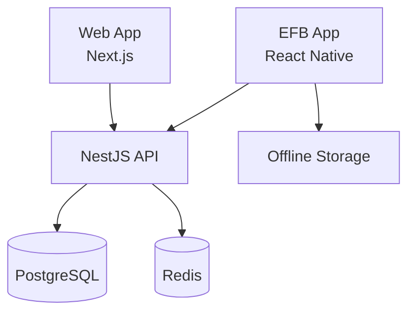

# SkyManuals 🛫

[](https://github.com/organization/skymanuals/actions)
[](https://github.com/semantic-release/semantic-release)
[](https://opensource.org/licenses/MIT)

**En production-ready monorepo för flygplatstillstånd och dokumentationshantering.**

SkyManuals är en komplett lösning för att hantera flygdokumentation med:
- **Web App**: Administrativt gränssnitt med Next.js 14
- **API**: Robust backend med NestJS, PostgreSQL och Redis
- **EFB App**: Offline-capable React Native mobilapp

## 🚀 Snabbstart

### Förutsättningar
- Node.js 18+
- Docker & Docker Compose
- Git

### Installation

```bash
# Klona repository
git clone https://github.com/organization/skymanuals.git
cd skymanuals

# Installera dependencies
npm install

# Konfigurera environment
cp env.template .env

# Starta utvecklingsmiljö
docker-compose up -d
npm run dev
```

### Verifiera Installation

```bash
npm run smoke
```

Alla tjänster körs nu på:
- **Web App**: http://localhost:3000
- **API**: http://localhost:3001
- **API Documentation**: http://localhost:3001/api

## 🏗 Arkitektur



Se [ARCHITECTURE.md](./docs/ARCHITECTURE.md) för detaljerade arkitekturdiagramm.

## 📦 Monorepo Struktur

```
skymanuals/
├── apps/
│   ├── web/          # Next.js 14 web application
│   ├── api/          # NestJS API service
│   └── efb/          # React Native EFB app
├── packages/
│   ├── ui/           # Shared React components
│   ├── types/        # Shared TypeScript types
│   └── config/       # Shared configurations
├── docs/             # Documentation
├── .github/          # GitHub workflows & templates
└── docker-compose.yml
```

## 🛢 Teknologi Stack

### Web App (`apps/web`)
- **Next.js 14** med App Router
- **TypeScript** för typsäkerhet
- **Tailwind CSS** för styling
- **shadcn/ui** komponentbibliotek
- **TipTap** rich text editor
- **OIDC Autentisering** (Auth0/Entra/Keycloak)

### API (`apps/api`)
- **NestJS** för enterprise-grade backend
- **Prisma ORM** med PostgreSQL + pgvector
- **Redis** för caching och sessions
- **Zod** för runtime validation
- **OpenAPI/Swagger** för dokumentation
- **OpenTelemetry** för observability

### EFB App (`apps/efb`)
- **React Native** med Expo
- **Offline filesystem cache**
- **OTA updates** med Expo Updates
- **Sami OIDC providers** som web

## 🔧 Utvecklingskommandon

### Allmänna Kommandon
```bash
npm run dev          # Starta alla services i development mode
npm run build        # Bygg alla applications
npm run lint         # Lint entire monorepo
npm run typecheck    # TypeScript type checking
npm run test         # Run all tests
npm run smoke        # End-to-end smoke test
```

### Specifika Workspaces
```bash
# Web app
npm run dev --workspace=apps/web
npm run build --workspace=apps/web

# API service
npm run dev --workspace=apps/api
npm run db:generate --workspace=apps/api

# EFB app
npm run start --workspace=apps/efb
npm run build --workspace=apps/efb
```

### Docker Development
```bash
docker-compose up -d              # Starta alla services
docker-compose up postgres redis # Endast database services
docker-compose logs api          # Visa API logs
docker-compose down              # Stoppa alla services
```

## 🔄 GitHub Workflow

### Branch Strategy
- `feature/*` - Nya funktioner
- `fix/*` - Bug fixes
- `chore/*` - Maintenance och updates
- `main` - Production branch

### Commit Standards
Vi använder **Conventional Commits**:
```bash
feat(web): add user dashboard
fix(api): resolve authentication bug  
docs: update setup instructions
chore(deps): upgrade dependencies
```

### CI/CD Pipeline
- **PR Validation**: Linting, typecheck, tests, build
- **Semantic PR**: Automatisk validering av commit format
- **Auto Release**: Semantic versioning med changesets
- **Docker Build**: Automatisk Docker image deployment

## 📚 Dokumentation

- **[Arkitektur](./docs/ARCHITECTURE.md)** - Detaljerade systemdiagramm och beslut
- **[Bidrag](./docs/CONTRIBUTING.md)** - Utvecklingsguide och best practices
- **[API Documentation](http://localhost:3001/api)** - Swagger/OpenAPI spec

## 🧪 Testing

### Smoke Test
```bash
npm run smoke
```
Validerar att alla tjänster fungerar tillsammans.

### Health Checks
```bash
curl http://localhost:3001/api/health
```
Returmenar systemhälsa och commit information.

## 📋 Baseline Features

### ✅ Implementerat
- **Health Endpoint**: `/api/health` med systemstatus
- **Web Landing Page**: OIDC login scaffold
- **EFB Splash Screen**: React Native app med offline cache
- **Smoke Test Script**: End-to-end validation
- **Monorepo Structure**: Turborepo med workspace configuration
- **Docker Compose**: Komplett development environment
- **TypeScript**: Strict type checking genom hela stacken

### 🚧 Nästa Steg
- [ ] Implementera faktisk OIDC autentisering
- [ ] Lägg till dokumentationshantering
- [ ] Search med pgvector implementation
- [ ] Offline sync för EFB app

## 🔐 Produktionsmiljö

### Environment Variables
Se `env.template` för alla konfigurationsalternativ.

### Säkerhet
- **OIDC Standard**: Industrimodärna authentication
- **Database Encryption**: Transit och at-rest
- **Secret Management**: Environment-based config
- **CORS Configuration**: Säker cross-origin handling

## 🤝 Bidra

Se [CONTRIBUTING.md](./docs/CONTRIBUTING.md) för detaljerade guidelines.

### Snabbguide:
1. Fork repository
2. Skapa feature branch: `git checkout -b feature/amazing-feature`
3. Commit med Conventional Commits: `git commit -m 'feat: add amazing feature'`
4. Skapa PR med detaljerat beskrivning
5. Vänta på review och merge

## 📄 Lisens

Detta projekt är licensierad under MIT License - se [LICENSE](./LICENSE) filen för detaljer.

## ⭐ Stjärnstjärna

Om detta projekts är hjälpsam för dig, överväg att lägga till en stjärra! 

---

**Byggt med ❤️ för flygindustrin**


