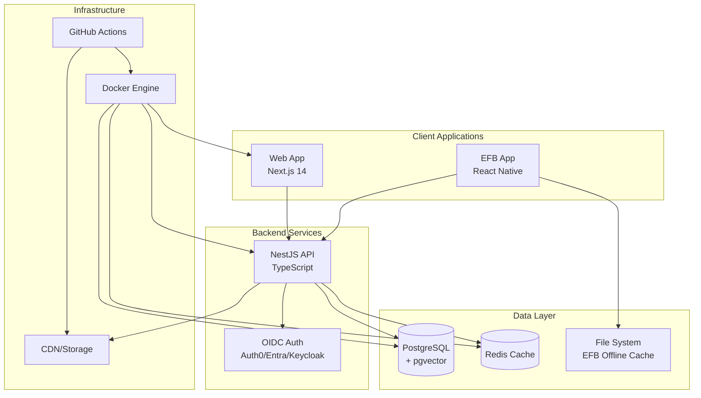

# SkyManuals Aviation Platform Architecture

## Overview

SkyManuals är en **production-ready aviation platform** som hanterar Electronic Flight Bag (EFB) dokumentation, maintenance manuals, och flight operations procedures. Systemet är designat för **strict regulatory compliance** (EASA/FAA) med fokus på offline-first operations och flight safety.

## Systemarkitektur



## Komponenter

### Frontend Applikationer

#### Web App (`apps/web`)
- **Teknologi**: Next.js 14 med App Router
- **Språk**: TypeScript
- **Styling**: Tailwind CSS
- **Komponenter**: shadcn/ui komponentbibliotek
- **Editor**: TipTap rich text editor
- **Autentisering**: OIDC integration (Auth0/Microsoft/Keycloak)

**Ansvar**:
- Användargränssnitt för administration
- Hantering av organisationer och roller
- Redigering av dokumentation
- Rapporter och dashboards

#### EFB App (`apps/efb`)
- **Teknologi**: React Native med Expo
- **Offline-funktioner**: Lokal filcache
- **Uppdateringar**: OTA updates med Expo Updates
- **Autentisering**: Samma OIDC providers som web

**Ansvar**:
- Mobilanvändning i flygmiljöer
- Offline-tillgång till kritiska dokument
- Enkel navigering och sökning
- Uppdatering av dokument nätverksresurser

### Backend Tjänster

#### API Service (`apps/api`)
- **Teknologi**: NestJS med TypeScript
- **Databas**: Prisma ORM + PostgreSQL + pgvector
- **Cache**: Redis för uppsökning och sessioner
- **Autentisering**: Passport.js med OIDC
- **Validering**: Zod scheman
- **Dokumentation**: OpenAPI/Swagger
- **Monitoring**: OpenTelemetry hooks

**Endpoints**:
- `/api/health` - Systemhälsa och monitoring
- `/api/auth/*` - Autentisering och autorisering
- `/api/organizations/*` - Organisationshantering
- `/api/documents/*` - Dokumentadministration
- `/api/search/*` - Vectorsökning med pgvector

### Delade Paket

#### UI Package (`packages/ui`)
- **Syfte**: Återanvändbara React-komponenter
- **Styling**: Tailwind CSS med shadcn/ui
- **Tillgänglighet**: Radix UI primitives
- **Responsiv design**: Mobile-first approach

#### Types Package (`packages/types`)
- **Syfte**: Delade TypeScript typer och Zod scheman
- **Användning**: Fördel mellan alla applikationer
- **Validering**: Runtime-type checking med Zod

#### Config Package (`packages/config`)
- **Syfte**: Centraliserad konfiguration
- **Innehåll**: ESLint, Prettier, TypeScript configs
- **Versionshantering**: Enhetlig kodstandard

## Aviation Data Model

### Document Management Schema
```sql
-- Aviation-compliant document structure
Documents:
  - id, org_id, document_type (AFM/MMEL/SOP/etc.)
  - title, content, vectors, version
  - status (DRAFT/APPROVED/ARCHIVED)
  - effective_date, expiry_date
  - checksum, approved_by, approved_at
  
Document_Revisions:
  - id, document_id, version
  - content, changed_by, changed_at
  - change_description, approval_chain
  
Audit_Logs:
  - id, entity_type, entity_id
  - action, user_id, timestamp
  - old_values, new_values, integrity_hash
```

### Compliance & Regulatory Tracking
```sql
-- Aviation compliance models
RegulatoryFramework:
  - id, source (EASA/FAA/Icao), region
  - title, version, effective_date
  - compliance_requirements
  
ComplianceLinks:
  - id, document_id, regulation_id
  - link_type, confidence_score
  - reviewed_by, review_date
```

### Redis Cache
- **Sessioner**: Användarautentisering
- **API Cache**: Sökresultat och ofta begärda data
- **Rate Limiting**: Skydd mot överbelastning

### EFB Offline Sync Strategy
- **Critical Documents Priority**: AFM, MMEL, Emergency Procedures first
- **Conflict Resolution**: Server-wins för regulatory docs, Client-wins för annotations
- **Sync Stages**: Pre-flight (critical), Mid-flight (high-priority), Maintenance (operational)
- **Chain of Custody**: SHA-256 hash verification för integrity
- **Extended Offline**: 72+ hour operation capability with conflict management

#### Sync Priority Matrix
```
CRITICAL_SAFETY (Level 1):    AFM, MMEL, Emergency Procedures
HIGH_SAFETY (Level 2):        SOPs, Checklists, Flight Manuals  
OPERATIONAL (Level 3):        Charts, Airport Information
MAINTENANCE (Level 4):        Technical Manuals, Service Bulletins
POLICY (Level 5):             Company Policies, Training Materials
HISTORICAL (Level 6):         Archived Documents, References
```

## Säkerhet och Compliance

### Autentisering och Autorisation
- **OIDC Standard**: Säker, standardiserad autentisering
- **Multi-Provider**: Auth0, Microsoft Entra, Keycloak
- **Rollbaserade behörigheter**: Admin, User, Viewer roller
- **Organisationsisolering**: Data isoleras per organisation

### Aviation Security & Compliance
- **TLS 1.3**: End-to-end encryption för all verkar kommunikation
- **Encryption at Rest**: AES-256 för databas och fil-lagring
- **Aviation Regulations**: EASA/FAA/Icao compliance frameworks
- **Audit Logging**: Comprehensive chain of custody för tutte ändringar
- **Data Retention**: 7+ år för aviation data per regulatory requirements
- **Backup Strategy**: Daily encrypted backups med point-in-time recovery
- **Disaster Recovery**: RTO: 4 hours, RPO: 1 hour för critical operations

### Security Hardening
- **Rate Limiting**: Protection mot brute force och abuse
- **Input Validation**: Comprehensive sanitization för all user input
- **Security Headers**: Complete CSP, HSTS, och X-*. protection
- **Dependency Scanning**: Automated vulnerability detection
- **Penetration Testing**: Regular security assessments

## Aviation Monitoring & Compliance

### Service Level Objectives (SLO)
| Service | Availability | Response Time | Error Rate |
|---------|-------------|---------------|------------|
| API Gateway | 99.95% | P99 < 2s | < 0.1% |
| Authentication | 99.99% | P99 < 1s | < 0.05% |
| EFB Sync | 99.5% | P99 < 15s | < 2% |
| Document Storage | 99.99% | P99 < 500ms | < 0.01% |

### Aviation-Specific Alerts
- **Flight Operations Critical**: EFB sync failures, critical document outages
- **Regulatory Compliance**: Audit log corruption, data integrity breaches
- **Performance Degradation**: API slowdown affecting flight operations
- **Security Incidents**: Unauthorized access, data exfiltration attempts

### Observability Stack
- **OpenTelemetry**: Distributed tracing across services
- **Custom Metrics**: Aviation KPIs (document currency, sync success rates)
- **Structured Logging**: JSON logs with aviation context (flight number, aircraft registration)
- **Business Intelligence**: Flight operations dashboards and compliance reporting

## Deployment och DevOps

### Docker Container Strategi
- **Microservices**: Separata containers för varje tjänst
- **Asset Optimization**: Build-time optimering för produktion
- **Secrets**: Environment variables för säker konfiguration

### CI/CD Pipeline
- **GitHub Actions**: Automatiserad testing och deployment
- **Quality Gates**: Linting, typechecking, testing före merge
- **Semantic Versioning**: Changesets för paketversionshantering
- **Release Management**: Automatisk changelog generering

### Environments
- **Development**: Lokal Docker Compose med hot reload
- **Staging**: Automatisk deployment för testning
- **Production**: Zero-downtime deployments med health checks

## Skalbarhet

### Horizontal Scaling
- **Stateless API**: Lagringsmaterial för skalning
- **Load Balancing**: Distribution av trafikflöde
- **Database Scaling**: Read replicas för höga läsvolym

### Performance Optimizations
- **CDN**: Statisk innehåll distribution
- **Caching**: Multi-layer caching strategy
- **Vector Search**: pgvector för snabb semantisk sökning
- **Connection Pooling**: Effektiv databasansluta

## Utveckling och Förvaltning

### Code Quality
- **Monorepo**: Delad utveckling och konsistent versionshantering
- **Conventional Commits**: Automatiserad changelog generation
- **Automated Testing**: Unit, integration, och smoke tests
- **Code Review**: Obligatorisk peer review för alla ändringar

### Documentation
- **API Documentation**: Auto-genererad från OpenAPI spec
- **Development Guide**: Detaljerade setup instructions
- **Architecture Decision Records**: Dokumenterade arkitektursbeslut

Denna arkitektur säkerställer en robust, skalbar och säker lösning för flygindustrins specifika behov med fokus på offline-tillgänglighet och kritisk dokumenthantering.
