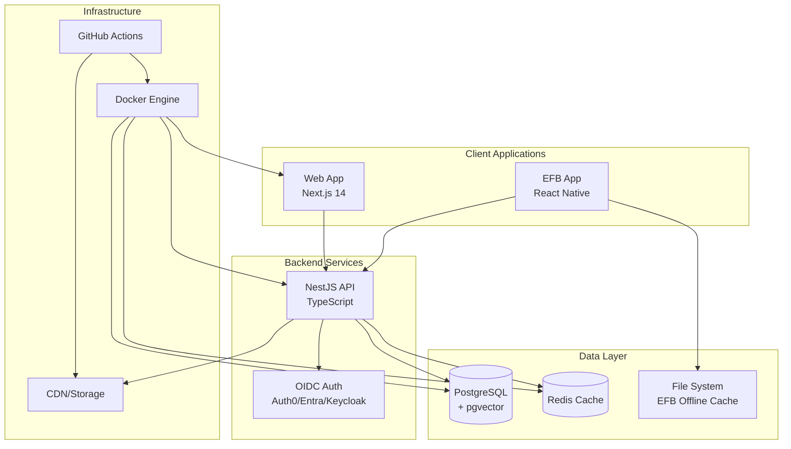

# SkyManuals Arkitektur

## Översikt

SkyManuals är en production-ready monorepo som hanterar flygplatstillstånd och dokumentation. Systemet består av tre huvudsakliga applikationer som arbetar tillsammans för att leverera en komplett lösning för flygindustrin.

## Systemarkitektur



## Komponenter

### Frontend Applikationer

#### Web App (`apps/web`)
- **Teknologi**: Next.js 14 med App Router
- **Språk**: TypeScript
- **Styling**: Tailwind CSS
- **Komponenter**: shadcn/ui komponentbibliotek
- **Editor**: TipTap rich text editor
- **Autentisering**: OIDC integration (Auth0/Microsoft/Keycloak)

**Ansvar**:
- Användargränssnitt för administration
- Hantering av organisationer och roller
- Redigering av dokumentation
- Rapporter och dashboards

#### EFB App (`apps/efb`)
- **Teknologi**: React Native med Expo
- **Offline-funktioner**: Lokal filcache
- **Uppdateringar**: OTA updates med Expo Updates
- **Autentisering**: Samma OIDC providers som web

**Ansvar**:
- Mobilanvändning i flygmiljöer
- Offline-tillgång till kritiska dokument
- Enkel navigering och sökning
- Uppdatering av dokument nätverksresurser

### Backend Tjänster

#### API Service (`apps/api`)
- **Teknologi**: NestJS med TypeScript
- **Databas**: Prisma ORM + PostgreSQL + pgvector
- **Cache**: Redis för uppsökning och sessioner
- **Autentisering**: Passport.js med OIDC
- **Validering**: Zod scheman
- **Dokumentation**: OpenAPI/Swagger
- **Monitoring**: OpenTelemetry hooks

**Endpoints**:
- `/api/health` - Systemhälsa och monitoring
- `/api/auth/*` - Autentisering och autorisering
- `/api/organizations/*` - Organisationshantering
- `/api/documents/*` - Dokumentadministration
- `/api/search/*` - Vectorsökning med pgvector

### Delade Paket

#### UI Package (`packages/ui`)
- **Syfte**: Återanvändbara React-komponenter
- **Styling**: Tailwind CSS med shadcn/ui
- **Tillgänglighet**: Radix UI primitives
- **Responsiv design**: Mobile-first approach

#### Types Package (`packages/types`)
- **Syfte**: Delade TypeScript typer och Zod scheman
- **Användning**: Fördel mellan alla applikationer
- **Validering**: Runtime-type checking med Zod

#### Config Package (`packages/config`)
- **Syfte**: Centraliserad konfiguration
- **Innehåll**: ESLint, Prettier, TypeScript configs
- **Versionshantering**: Enhetlig kodstandard

## Data Arkitektur

### PostgreSQL Databas
```sql
-- Huvudtabeller
Organizations: id, name, slug, logo_url
Users: id, email, name, org_id, role
Documents: id, title, content, vectors, org_id
Permissions: user_id, document_id, permission_level
```

### Redis Cache
- **Sessioner**: Användarautentisering
- **API Cache**: Sökresultat och ofta begärda data
- **Rate Limiting**: Skydd mot överbelastning

### EFB Offline Storage
- **Kritiska dokument**: Lokalt sparade PDFs/manuals
- **Metadata**: Sökindex för offline-sökning
- **Deltas**: Endast ändringar synkas

## Säkerhet och Compliance

### Autentisering och Autorisation
- **OIDC Standard**: Säker, standardiserad autentisering
- **Multi-Provider**: Auth0, Microsoft Entra, Keycloak
- **Rollbaserade behörigheter**: Admin, User, Viewer roller
- **Organisationsisolering**: Data isoleras per organisation

### Dataskydd
- **Kryptering**: TLS för transit, encryption-at-rest
- **GDPR Compliance**: Användarhantering och dataämnesrättigheter
- **Backup**: Regelbundna säkerhetskopior mot dataförlust

## Monitoring och Observability

### Health Checks
- **API Health**: `/api/health` endpoint med verksamhetsinformation
- **Database Metrics**: Anslutningsstatus och prestanda
- **Cache Status**: Redis tillgänglighet och användning

### Logging
- **Strukturerad loggning**: JSON-format för parsing
- **Correlation IDs**: Spårbarhet genom systemet
- **Nivåhantering**: Debug, Info, Warn, Error

## Deployment och DevOps

### Docker Container Strategi
- **Microservices**: Separata containers för varje tjänst
- **Asset Optimization**: Build-time optimering för produktion
- **Secrets**: Environment variables för säker konfiguration

### CI/CD Pipeline
- **GitHub Actions**: Automatiserad testing och deployment
- **Quality Gates**: Linting, typechecking, testing före merge
- **Semantic Versioning**: Changesets för paketversionshantering
- **Release Management**: Automatisk changelog generering

### Environments
- **Development**: Lokal Docker Compose med hot reload
- **Staging**: Automatisk deployment för testning
- **Production**: Zero-downtime deployments med health checks

## Skalbarhet

### Horizontal Scaling
- **Stateless API**: Lagringsmaterial för skalning
- **Load Balancing**: Distribution av trafikflöde
- **Database Scaling**: Read replicas för höga läsvolym

### Performance Optimizations
- **CDN**: Statisk innehåll distribution
- **Caching**: Multi-layer caching strategy
- **Vector Search**: pgvector för snabb semantisk sökning
- **Connection Pooling**: Effektiv databasansluta

## Utveckling och Förvaltning

### Code Quality
- **Monorepo**: Delad utveckling och konsistent versionshantering
- **Conventional Commits**: Automatiserad changelog generation
- **Automated Testing**: Unit, integration, och smoke tests
- **Code Review**: Obligatorisk peer review för alla ändringar

### Documentation
- **API Documentation**: Auto-genererad från OpenAPI spec
- **Development Guide**: Detaljerade setup instructions
- **Architecture Decision Records**: Dokumenterade arkitektursbeslut

Denna arkitektur säkerställer en robust, skalbar och säker lösning för flygindustrins specifika behov med fokus på offline-tillgänglighet och kritisk dokumenthantering.
