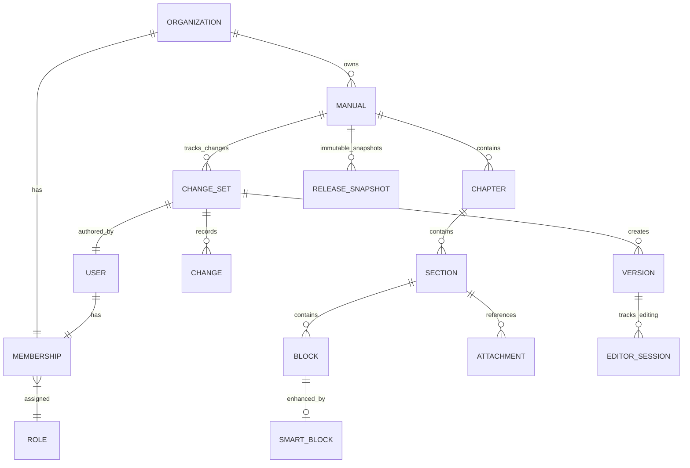
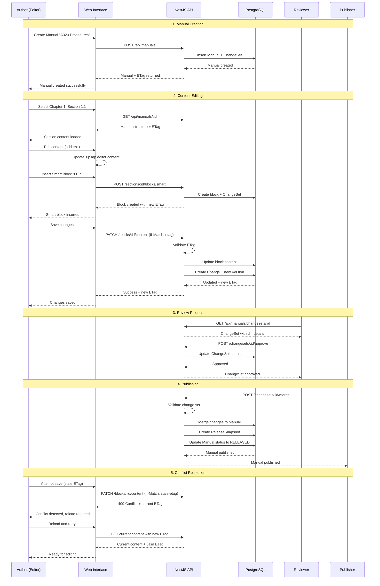
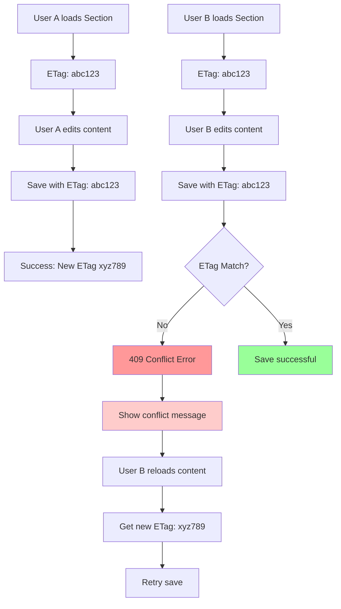

# Epic-01: Structured Authoring & Collaboration

## Overview

Epic-01 implements structured authoring and collaboration capabilities for SkyManuals, enabling multiple users to work on aviation manuals with rich content editing, change tracking, and publication workflows.

## Domain Architecture

### Core Entities



### Hierarchy Structure

```
Organization (hemanhuntes Airline)
├── Manual (A320 Flight Manual v2.1)
│   ├── Chapter 1 (Airplane General)
│   │   ├── Section 1.1 (Airplane Identification)
│   │   │   ├── Block 1.1.1 [Text: "The A320 is a..."](LEP))
│   │   │   ├── Block 1.1.2 [SmartBlock: MEL](MEL)
│   │   │   └── Block 1.1.3 [CrossRef: Ch.2.5](CrossRef)
│   │   └── Section 1.2 (Configuration)
│   ├── Chapter 2 (Pilot Operating Procedures)
│   └── Chapter 3 (Performance)
```

## Key Features

### 1. Structured Editing

**TipTap Integration**: Rich text editor with aviation-specific formatting
- **Smart Blocks**: Specialized content blocks for aviation documentation
  - **LEP** (List of Effective Pages): Automatically maintained page references
  - **MEL** (Minimum Equipment List): Equipment status and limitations
  - **ChangeLog**: Revision history tracking
  - **RevisionBar**: Visual revision indicators
  - **CrossRef**: Cross-reference markers

**Template System**: Pre-defined content structures for different manual types

### 2. Collaborative Workflow

**Role-Based Access**:
- **ADMIN**: Full system access, can approve/reject all changes
- **EDITOR**: Can create/edit content, create change sets
- **REVIEWER**: Can review and approve/reject change sets
- **READER**: Read-only access to released content

**Change Tracking**:
- All modifications captured in ChangeSets
- Diff engine provides detailed change analysis
- Version history with ETags for optimistic locking

### 3. Optimistic Locking & Conflict Resolution

**ETag Validation**: Prevents concurrent editing conflicts
```typescript
// HTTP Headers example
If-Match: "abc123-def456"
If-Content-Modified-After: "2024-01-03T10:00:00Z"
```

**Conflict Resolution**:
1. User A and B both load section with ETag "abc123"
2. User A modifies content first, gets new ETag "xyz789"
3. User B attempts to save with old ETag "abc123"
4. System returns 409 Conflict with current ETag
5. User B must reload and reapply changes

## Implementation Details

### Backend (NestJS)

#### API Endpoints

```typescript
// Manual CRUD
GET    /api/manuals/:id           # Get manual with structure
POST   /api/manuals               # Create new manual
PATCH  /api/manuals/:id           # Update manual (with If-Match)

// Chapter Management
POST   /api/manuals/:id/chapters # Create chapter
PATCH  /api/manuals/chapters/:id # Update chapter

// Section & Block Editing
POST   /api/manuals/chapters/:id/sections    # Create section
PATCH  /api/manuals/sections/:id/content     # Update section content

// Block-level TipTap operations
PATCH  /api/manuals/blocks/:id/content       # Update block with TipTap JSON
POST   /api/manuals/sections/:id/blocks/smart # Insert smart block

// Change Set Management
GET    /api/manuals/changesets/:id           # Get change set details
POST   /api/manuals/changesets/:id/approve   # Approve change set
POST   /api/manuals/changesets/:id/reject    # Reject change set
POST   /api/manuals/changesets/:id/merge     # Merge change set

// Export Options
GET    /api/manuals/:id/export/html         # Export as HTML
GET    /api/manuals/:id/export/pdf          # Export as PDF
```

#### Diff Engine

```typescript
class DiffEngineService {
  compareTipTapDocuments(oldDoc: TipTapDocument, newDoc: TipTapDocument): Diff
  
  validateETag(currentETag: string, providedETag?: string): boolean
  
  createConflictError(currentETag: string, providedETag?: string): ConflictError
  
  generateTextualDiff(diff: Diff): string
}
```

#### Smart Block Configurations

```json
{
  "LEP": {
    "autoNumbering": true,
    "includeSubPages": false,
    "format": "page-range"
  },
  "MEL": {
    "equipmentCode": "required",
    "limitations": "required",
    "revisionTracking": true
  },
  "ChangeLog": {
    "autoDate": true,
    "includeAuthor": true,
    "detailLevel": "comprehensive"
  },
  "RevisionBar": {
    "showTime": true,
    "showAuthor": true,
    "maxVisible": 10
  },
  "CrossRef": {
    "targetValidation": true,
    "autoUpdate": true,
    "linkFormat": "target-path"
  }
}
```

### Frontend (Next.js)

#### Editor Components

```tsx
// Main editor interface
<ManualEditor>
  <TableOfContents />
  <SectionSelector />
  <TipTapEditor />
  <SmartBlockToolbar />
  <RevisionBar />
  <SaveIndicators />
</ManualEditor>
```

#### State Management

```typescript
interface EditorState {
  manual: Manual;
  selectedSection: Section | null;
  content: TipTapDocument;
  etag: string;
  pendingChanges: boolean;
  activeUsers: User[];
}
```

## Workflow Sequence

### Create-Edit-Release Flow



### Concurrent Editing Prevention



## Testing Strategy

### Unit Tests
- **Diff Engine**: TipTap document comparison logic
- **ETag Validation**: Optimistic locking mechanisms
- **Smart Block Configuration**: Template validation

### Integration Tests (SuperTest)
- **API CRUD Operations**: Manual/Chapter/Section/Block endpoints
- **ETag Conflict Handling**: 409 responses with proper error format
- **ChangeSet Workflow**: Status transitions and approvals
- **Export Functionality**: HTML/PDF generation stubs

### E2E Tests (Playwright)
- **Editor Workflow**: Create manual → Edit sections → Save content
- **Smart Block Insertion**: All 5 smart block types
- **Conflict Resolution**: Multi-user editing scenarios
- **Review Process**: Reviewer approval/rejection flow

## Smart Blocks Details

### LEP (List of Effective Pages)
```json
{
  "type": "smartBlock_LEP",
  "attrs": {
    "manualId": "manual-123",
    "lastUpdate": "2024-01-03T10:00:00Z"
  },
  "content": [
    {
      "type": "lepTable",
      "content": [
        {"type": "lepEntry", "attrs": {"page": "1-1", "section": "Chapter 1.1"}},
        {"type": "lepEntry", "attrs": {"page": "1-2", "section": "Chapter 1.2"}}
      ]
    }
  ]
}
```

### MEL (Minimum Equipment List)
```json
{
  "type": "smartBlock_MEL",
  "attrs": {
    "equipmentCode": "FUEL-IND",
    "status": "OPERATIONAL",
    "limitations": "None"
  },
  "content": [
    {"type": "text", "text": "Fuel Quantity Indicators - OPERATIONAL"}
  ]
}
```

### ChangeLog
```json
{
  "type": "smartBlock_ChangeLog",
  "attrs": {
    "revision": "2.1",
    "date": "2024-01-03",
    "author": "john.doe@safair.com"
  },
  "content": [
    {"type": "text", "text": "Updated fuel consumption tables for climb procedures"}
  ]
}
```

## Dependencies

### Backend Dependencies
```json
{
  "dependencies": {
    "@nestjs/swagger": "^7.1.17",
    "@skymanuals/types": "workspace:*"
  }
}
```

### Frontend Dependencies
```json
{
  "dependencies": {
    "@tiptap/react": "^2.1.13",
    "@tiptap/starter-kit": "^2.1.13",
    "@tiptap/extension-placeholder": "^2.1.13"
  }
}
```

## Future Enhancements

1. **Real-time Collaboration**: WebSocket-based live editing indicators
2. **Advanced Diff Visualization**: Side-by-side diff viewer
3. **Template Library**: Aviation-specific manual templates
4. **Automated Cross-references**: Link validation and auto-correction
5. **Workflow Customization**: Organization-specific approval processes

## Security Considerations

- **Role-based Authorization**: All operations validate user permissions
- **ETag Validation**: Prevents unauthorized modifications
- **Input Sanitization**: TipTap content sanitized before storage
- **Audit Trails**: All changes logged with timestamps and user IDs

This Epic establishes the foundation for structured aviation manual authoring with robust collaboration features, change tracking, and conflict resolution.


