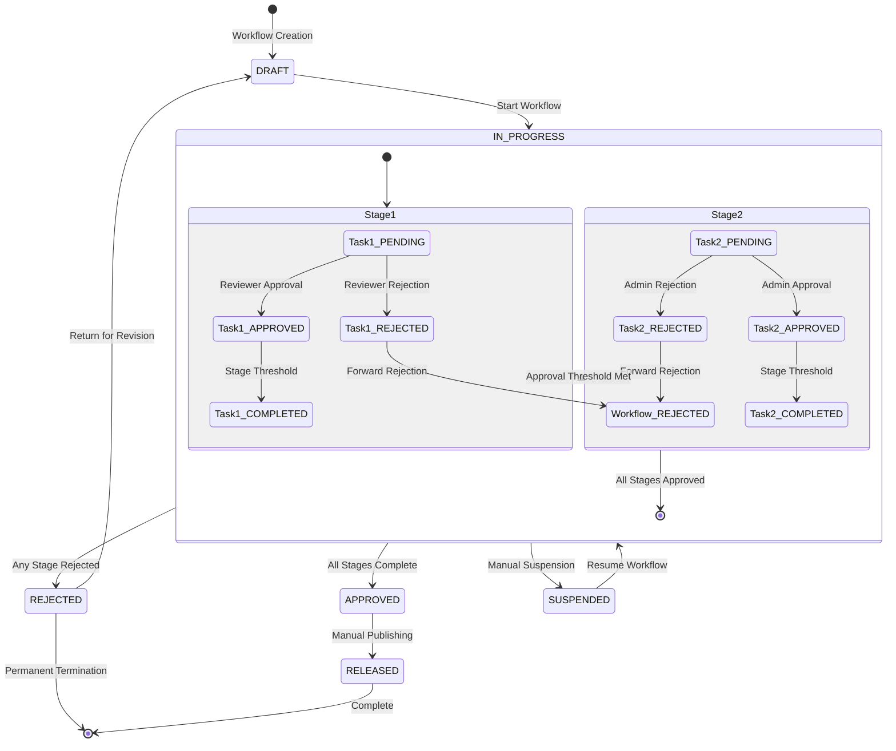

# Epic-02: Configurable Review & Approval Workflows

## Overview

Epic-02 implements a comprehensive review and approval system for aviation manuals, enabling configurable workflows with role-based approvals, task management, comment threads, and automated PDF generation for audit compliance.

## Core Capabilities

### 🏗️ Workflow Definition System
- **Configurable Stages**: Define multi-stage approval processes
- **Role-Based Assignments**: Assign tasks to specific roles (ADMIN, EDITOR, REVIEWER, READER)
- **Parallel Processing**: Support concurrent pipeline stages
- **Auto-Approval Conditions**: Conditional automation based on validation rules
- **Rejection Handling**: Granular rejection workflows with detailed feedback

### 📋 Task Management
- **Task Assignment**: Automatic task creation based on workflow stages
- **Priority Levels**: CRITICAL, HIGH, MEDIUM, LOW priority handling
- **Due Date Management**: Deadline tracking with overdue notifications
- **Delegation Support**: Task reassignment capabilities
- **Status Tracking**: Complete lifecycle management (PENDING → APPROVED/REJECTED)

### 💬 Collaboration Features
- **Comment Threading**: Nested discussion threads per task
- **Mention System**: @user notifications for targeted communication
- **Internal Notes**: Private reviewer-to-reviewer communication
- **Attachment Support**: File sharing within comment threads
- **Resolution Tracking**: Mark discussion points as resolved

### 📄 Document Generation
- **Approval Letters**: Professional PDF generation with signatures
- **Audit Checklists**: One-click checklist creation for compliance
- **Validation Signatures**: Digital signature integration
- **Compliance Reports**: Automated regulatory documentation

## Architecture

### State Machine Diagram



### Workflow Configuration Example

```json
{
  "id": "manual-review-workflow",
  "name": "Aviation Manual Review Process",
  "entityType": "manual",
  "stages": [
    {
      "id": "technical-review",
      "name": "Technical Review",
      "requiredRoles": ["REVIEWER", "SENIOR_ENGINEER"],
      "approvalThreshold": 1,
      "maxDurationHours": 72,
      "allowsRejection": true,
      "autoApproveConditions": [
        "sectionCount < 10 AND lastModified > 7days"
      ]
    },
    {
      "id": "compliance-review", 
      "name": "Compliance Review",
      "requiredRoles": ["COMPLIANCE_OFFICER"],
      "approvalThreshold": 1,
      "maxDurationHours": 48,
      "parallelStages": ["safety-review"]
    },
    {
      "id": "final-approval",
      "name": "Final Approval",
      "requiredRoles": ["ADMIN"],
      "approvalThreshold": 1,
      "maxDurationHours": 24
    }
  ]
}
```

## API Endpoints

### Workflow Management
- `GET /api/workflows/definitions` - List organization workflows
- `POST /api/workflows/instances` - Create new workflow instance
- `GET /api/workflows/instances` - List workflow instances
- `GET /api/workflows/instances/:id` - Get workflow details
- `GET /api/workflows/metrics` - Analytics and reporting

### Task Management
- `GET /api/tasks` - List user's assigned tasks
- `GET /api/tasks/summary` - Task dashboard summary
- `PATCH /api/tasks/:id/approve` - Approve task
- `PATCH /api/tasks/:id/reject` - Reject task
- `PATCH /api/tasks/:id/delegate` - Delegate task

### Communication
- `POST /api/comments/tasks/:taskId` - Add comment to task
- `GET /api/comments/tasks/:taskId` - Get task comments
- `PATCH /api/comments/:id/toggle-resolved` - Mark comment resolved

## Frontend Components

### Reviewer Inbox
- **Dashboard View**: Task overview with filtering
- **Priority Indicators**: Visual priority and overdue highlighting
- **Bulk Actions**: Multi-task approval/rejection
- **Real-time Updates**: Socket-based live updates

### Task Detail View
- **Document Preview**: In-context manual viewing
- **Comment Thread**: Threaded discussions
- **Action Panel**: Approve/Reject/Delegate controls
- **Progress Tracking**: Stage completion indicators

### Workflow Builder
- **Visual Designer**: Drag-and-drop stage configuration
- **Role Assignment**: User/role mapping interface
- **Validation Rules**: Logic condition builder
- **Testing Mode**: Workflow simulation environment

## Database Schema

### Core Entities

```sql
-- Workflow Definitions
CREATE TABLE workflow_definitions (
  id UUID PRIMARY KEY,
  organization_id UUID NOT NULL,
  name VARCHAR(255) NOT NULL,
  description TEXT,
  entity_type VARCHAR(50) NOT NULL,
  stages JSONB NOT NULL, -- Array of WorkflowStage objects
  is_active BOOLEAN DEFAULT true,
  created_at TIMESTAMP DEFAULT NOW(),
  updated_at TIMESTAMP DEFAULT NOW()
);

-- Workflow Instances
CREATE TABLE workflow_instances (
  id UUID PRIMARY KEY,
  workflow_definition_id UUID NOT NULL,
  entity_type VARCHAR(50) NOT NULL,
  entity_id UUID NOT NULL,
  title VARCHAR(500) NOT NULL,
  status VARCHAR(50) DEFAULT 'DRAFT',
  current_stage_id VARCHAR(100),
  initiated_by_user_id UUID NOT NULL,
  due_date TIMESTAMP,
  priority VARCHAR(20) DEFAULT 'MEDIUM',
  created_at TIMESTAMP DEFAULT NOW(),
  completed_at TIMESTAMP
);

-- Approval Tasks
CREATE TABLE approval_tasks (
  id UUID PRIMARY KEY,
  workflow_instance_id UUID NOT NULL,
  stage_id VARCHAR(100) NOT NULL,
  assigned_to_user_id UUID NOT NULL,
  entity_type VARCHAR(50) NOT NULL,
  entity_id UUID NOT NULL,
  status VARCHAR(20) DEFAULT 'PENDING',
  priority VARCHAR(20) DEFAULT 'MEDIUM',
  due_at TIMESTAMP,
  completed_at TIMESTAMP,
  comments_count INTEGER DEFAULT 0,
  metadata JSONB
);

-- Comments
CREATE TABLE comments (
  id UUID PRIMARY KEY,
  task_id UUID NOT NULL,
  user_id UUID NOT NULL,
  content TEXT NOT NULL,
  type VARCHAR(50) DEFAULT 'general',
  is_internal BOOLEAN DEFAULT false,
  parent_comment_id UUID,
  attachments TEXT[],
  mentioned_user_ids UUID[],
  created_at TIMESTAMP DEFAULT NOW()
);
```

## Testing Strategy

### Unit Tests
- Workflow engine state transitions
- Task assignment logic
- Comment threading algorithms
- PDF generation validation

### Integration Tests
- API endpoint functionality
- Database transaction integrity
- Email notification delivery
- PDF signature verification

### E2E Tests
- Complete workflow lifecycle
- Multi-user collaboration scenarios
- Approval/Rejection workflows
- Notification delivery chain

## Configuration Examples

### Aircraft Manual Review Workflow

```json
{
  "name": "Aircraft Manual Review",
  "entityType": "manual",
  "stages": [
    {
      "id": "preliminary-review",
      "name": "Preliminary Review",
      "requiredRoles": ["TECHNICAL_SPECIALIST"],
      "approvalThreshold": 1,
      "maxDurationHours": 48,
      "description": "Initial technical accuracy review"
    },
    {
      "id": "compliance-check",
      "name": "Regulatory Compliance",
      "requiredRoles": ["COMPLIANCE_OFFICER", "LEGAL_ADVISOR"],
      "approvalThreshold": 2,
      "maxDurationHours": 72,
      "description": "Verify regulatory compliance"
    },
    {
      "id": "final-sign-off",
      "name": "Final Approval",
      "requiredRoles": ["CHIEF_PILOT", "MAINTAINENCE_MANAGER"],
      "approvalThreshold": 2,
      "maxDurationHours": 24,
      "description": "Final operational sign-off"
    }
  ]
}
```

### Emergency Change Workflow

```json
{
  "name": "Emergency Change Process",
  "entityType": "section", 
  "stages": [
    {
      "id": "expedited-review",
      "name": "Expedited Review",
      "requiredRoles": ["SENIOR_ENGINEER"],
      "approvalThreshold": 1,
      "maxDurationHours": 4,
      "autoApproveConditions": ["urgency = 'CRITICAL'"],
      "description": "Fast-track emergency changes"
    },
    {
      "id": "post-implementation-review",
      "name": "Post-Implementation Review",
      "requiredRoles": ["LEAD_ENGINEER"],
      "approvalThreshold": 1,
      "maxDurationHours": 168, // 7 days
      "description": "Validate emergency changes after implementation"
    }
  ]
}
```

## Notification System

### Notification Types
- **Task Assignment**: New task notification with priority
- **Overdue Alerts**: Escalating reminders for overdue items
- **Comment Mentions**: @user notification triggers
- **Status Changes**: Workflow progression updates
- **Approval Requests**: Direct approval/rejection prompts

### Delivery Channels
- **Email**: Rich HTML notifications with action buttons
- **Web Push**: Browser-based real-time notifications
- **In-App**: Internal notification center
- **Slack Integration**: Channel-specific workflow updates

### Template Examples

```html
<!-- Task Assignment Email -->
<div class="notification">
  <h2>New Review Task Assigned</h2>
  <p><strong>Document:</strong> Aircraft Maintenance Manual</p>
  <p><strong>Priority:</strong> <span class="high">HIGH</span></p>
  <p><strong>Due Date:</strong> March 15, 2024 - 23:59 UTC</p>
  <div class="actions">
    <a href="/tasks/task-123" class="button primary">View Task</a>
    <a href="/tasks/task-123/approve" class="button success">Quick Approve</a>
  </div>
</div>
```

## Performance Considerations

### Scalability Measures
- **Database Indexing**: Optimized query performance for large workflows
- **Caching Layer**: Redis-based workflow state caching
- **Async Processing**: Background task for heavy operations
- **Connection Pooling**: Efficient database connection management

### Monitoring & Observability
- **Workflow Metrics**: Dashboard with KPIs
- **Task Metrics**: Review speed and accuracy tracking
- **Error Tracking**: Comprehensive error logging and alerting
- **Performance Metrics**: Response time monitoring

## Security Considerations

### Data Protection
- **Encrypted Signatures**: Secure PDF signature storage
- **Audit Trails**: Complete activity logging
- **Access Controls**: Role-based permission enforcement
- **Data Retention**: Configurable archival policies

### Compliance
- **GDPR Compliance**: User data protection
- **Industry Standards**: Aviation-specific security requirements
- **Digital Signatures**: PKI-based authentication
- **Immutable Records**: Blockchain-style approval trails

## Future Enhancements

### Advanced Features
- **AI-Powered Suggestions**: Automated content improvements
- **Risk Assessment**: Intelligent risk scoring
- **Workflow Templates**: Industry-specific workflow libraries
- **Mobile Support**: Native mobile app for approvals

### Integrations
- **MS Teams**: Enterprise collaboration integration
- **Salesforce**: CRM and workflow synchronization
- **Document Systems**: SharePoint/Confluence integration
- **ERP Systems**: Enterprise resource planning sync

---

This Epic establishes the foundation for professional-grade aviation manual review processes, ensuring compliance, traceability, and efficient collaboration across all stakeholders.
