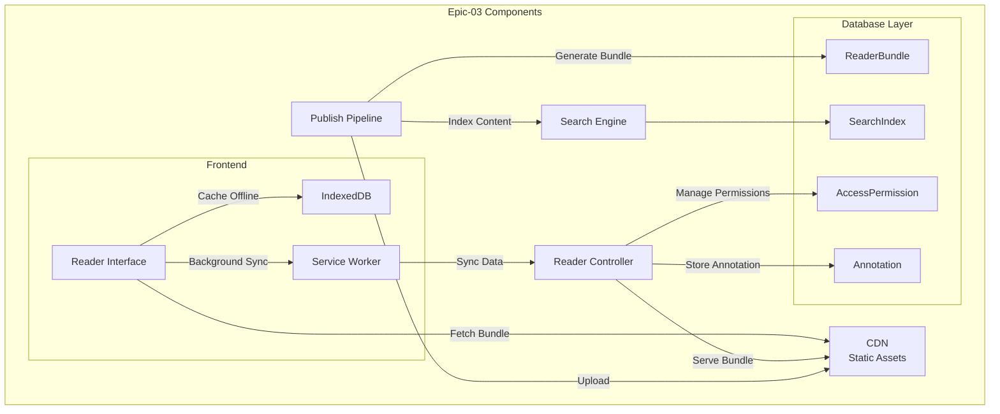
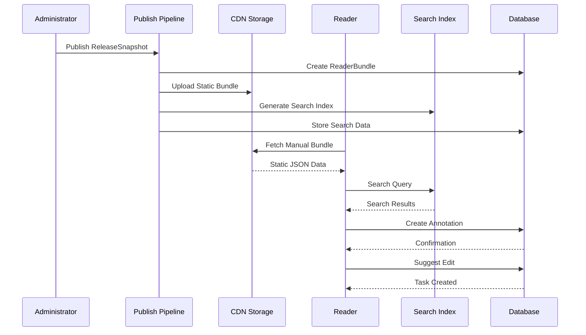

# Epic-03: Distribution & Reader

## Overview

Epic-03 introduces a comprehensive reader platform for published manuals with offline support, intelligent search, collaborative annotation tools, and modern reader capabilities.

## Capabilities

### 1. 📦 Publish Pipeline
- **Static JSON Bundles**: Convert ReleaseSnapshots into CDN-friendly static bundles
- **Bundle Versioning**: Support for multiple versions per manual (`v1.0.0`, `v1.1.0`, etc.)
- **CDN Integration**: Automatic upload to CDN with cache-friendly URLs
- **Size Optimization**: Bundle compression and size tracking

### 2. 🔍 Search Engine
- **Full-Text Search**: Index all manual content for fast searching
- **Keyword Extraction**: NLP-powered keyword and phrase extraction
- **Entity Recognition**: Aircraft types, procedures, and aviation terminology
- **Relevance Scoring**: Smart ranking based on multiple factors
- **Search Suggestions**: Auto-complete and popular search terms

### 3. 📖 Advanced Reader
- **Table of Contents**: Interactive navigation structure
- **Version Navigation**: Browse across different manual versions
- **Reading Progress**: Track reading sessions and progress
- **Bookmarking**: Save important sections for quick access
- **"What's New"**: Revision bars showing recent changes

### 4. ✍ Annotation System
- **Highlighting**: Color-coded text highlights
- **Notes**: Private annotations with rich formatting
- **Comments**: Discussion-style annotations
- **Questions**: Query-specific annotations
- **Warnings**: Safety-critical annotations

### 5. 💡 Suggest Edit
- **Text Selection**: Select any text to suggest improvements
- **Priority Levels**: LOW, MEDIUM, HIGH, CRITICAL
- **Task Creation**: Automatically creates editor tasks in Epic-02 workflows
- **Review Process**: Links to approval workflows

### 6. 📱 Offline Support
- **Service Worker**: Browser-based offline caching
- **IndexedDB**: Client-side data storage
- **Background Sync**: Sync annotations and reading sessions
- **Cache Management**: Size estimation and expiry handling
- **Sync Status**: Track synchronization state

### 7. 🔐 RBAC Delivery
- **Permission Model**: READ, ANNOTATE, SUGGEST_EDIT, ADMIN
- **Feature Flags**: Conditional feature access per organization
- **Access Control**: Per-user bundle permissions
- **Audit Logging**: Track all reader access events

## Architecture

### Components



### Data Flow



## API Endpoints

### Manual Reader Routes
- `GET /manuals/:manualId?v=X.Y.Z` - Load manual with version
- `GET /manuals/:manualId/bundles` - Get available bundles
- `GET /manuals/:manualId/permissions` - Check user permissions

### Search Routes
- `POST /search` - Full-text search across manuals
- `GET /search/suggestions?q=query` - Search suggestions
- `GET /search/popular?manualId=id` - Popular searches

### Annotation Routes
- `POST /manuals/:manualId/annotations` - Create annotation
- `GET /manuals/:manualId/annotations` - Get annotations
- `PUT /annotations/:annotationId` - Update annotation

### Suggest Edit Routes
- `POST /manuals/:manualId/suggest-edits` - Suggest edit
- `GET /manuals/:manualId/suggest-edits` - Get suggestions
- `PUT /suggest-edits/:suggestionId` - Review suggestion

### Session Routes
- `POST /manuals/:manualId/session` - Update reading session
- `GET /manuals/:manualId/session` - Get reading session

### Offline Routes
- `GET /manuals/:manualId/offline` - Get offline capabilities
- `POST /manuals/:manualId/cache` - Cache manual offline

## Database Schema

### ReaderBundle
```sql
model ReaderBundle {
  id               String @id @default(cuid())
  manualId         String
  releaseSnapshotId String
  version          String
  bundleUrl        String
  bundleSize       Int
  createdAt        DateTime @default(now())
  expiresAt        DateTime?
}
```

### SearchIndex
```sql
model SearchIndex {
  id            String @id @default(cuid())
  manualId      String
  bundleId      String
  searchableText String
  indexes       Json  // { keywords, phrases, entities, sections }
  createdAt     DateTime @default(now())
}
```

### Annotation
```sql
model Annotation {
  id          String @id @default(cuid())
  userId      String
  manualId    String
  bundleId    String
  chapterId   String
  sectionId   String
  blockId     String
  selector    String
  type        AnnotationType
  content     String
  color       String?
  isPrivate   Boolean @default(true)
  createdAt   DateTime @default(now())
  updatedAt   DateTime @updatedAt
}
```

### SuggestEdit
```sql
model SuggestEdit {
  id               String @id @default(cuid())
  userId           String
  manualId         String
  bundleId         String
  chapterId        String
  sectionId        String
  blockId          String
  selector         String
  currentText      String
  suggestedText    String
  reason           String
  priority         SuggestEditPriority @default(MEDIUM)
  status           SuggestEditStatus @default(PENDING)
  createdTaskId    String?
  reviewedBy       String?
  reviewedAt       DateTime?
  reviewerComments String?
  createdAt        DateTime @default(now())
  updatedAt        DateTime @updatedAt
}
```

## Frontend Components

### Reader Interface
- **ManualReader**: Main reading interface
- **TableOfContents**: Interactive navigation
- **SearchInterface**: Advanced search with filters
- **AnnotationTools**: Highlighting and annotation creation
- **SuggestEditDialog**: Edit suggestion modal
- **RevisionBars**: "What's New" indicators

### Offline Support
- **OfflineManager**: IndexedDB management
- **ServiceWorker**: Background sync and caching
- **CacheIndicator**: Online/offline status display
- **SyncManager**: Conflict resolution and queuing

## Testing Strategy

### Integration Tests
- **Manual Loading**: Bundle fetching and rendering
- **Search Functionality**: Query processing and results
- **Annotation CRUD**: Create, read, update, delete annotations
- **Suggest Edit Flow**: Edit suggestion to task creation
- **Offline Sync**: Background synchronization

### E2E Tests
- **Reader Workflow**: Complete reading session
- **Search Experience**: Query → Results → Selection
- **Annotation Workflow**: Highlight → Note → Sync
- **Offline Operation**: Cache → Read → Sync → Repeat

## Performance Considerations

### Bundle Optimization
- **Content Compression**: Gzip compression for bundles
- **Size Limits**: Target <5MB per bundle
- **CDN Caching**: Aggressive browser and CDN caching
- **Partial Loading**: Chapter-level lazy loading

### Search Performance
- **Index Pre-computation**: Generate indexes at publish time
- **Result Caching**: Cache popular search queries
- **Pagination**: Limit results for responsiveness
- **Background Indexing**: Async index updates

### Offline Efficiency
- **Bundle Splitting**: Separate bundles for different content types
- **Selective Caching**: User-configurable cache options
- **Compression**: Bundle data compression
- **Cleanup Policies**: Automatic cache expiry

## Security & Compliance

### Access Control
- **Permission Inheritance**: Organization → Manual → Bundle
- **Time-Limited Access**: Temporary bundle access for contractors
- **Audit Logging**: All reader access events tracked
- **Version Privacy**: Protection for draft versions

### Data Protection
- **Annotation Privacy**: Default private annotations
- **Secure Sync**: Encrypted offline data synchronization
- **CDN Security**: Signed URLs for sensitive content
- **Cache Encryption**: Sensitive data encryption at rest

## Implementation Status

### ✅ Completed
- [x] ReaderBundle model and API
- [x] SearchIndex generation and API
- [x] Annotation CRUD operations
- [x] SuggestEdit workflow integration
- [x] Reader session management
- [x] Service Worker for offline support
- [x] IndexedDB offline manager
- [x] Reader UI components
- [x] E2E test suite

### 🔄 In Progress
- [ ] CDN integration (currently mocked)
- [ ] Advanced NLP for search indexing
- [ ] Background sync optimization
- [ ] Performance monitoring

### 📋 Planned
- [ ] PWA manifest
- [ ] Push notifications
- [ ] Advanced search filters
- [ ] Collaborative annotations
- [ ] Mobile app integration

## Future Enhancements

### Enhanced Search
- **Semantic Search**: Understanding meaning, not just keywords
- **Visual Search**: Search for diagrams, charts, and images
- **Cross-Manual Search**: Search across multiple manuals
- **Saved Searches**: Personal search configurations

### Collaboration Features
- **Shared Annotations**: Team-visible annotation sharing
- **Discussion Threads**: Threaded comments on sections
- **Team Read Sessions**: Synchronized reading experiences
- **Expert Insights**: Tagged annotations by subject matter experts

### Advanced Analytics
- **Reading Patterns**: Heat maps of most-read sections
- **User Behavior**: Reading time, navigation patterns
- **Content Effectiveness**: Most-annotated sections
- **Knowledge Gaps**: Identified through search analytics

---

Epic-03 provides the foundation for modern, collaborative aircraft manual delivery with offline-first capabilities and intelligent search features.
