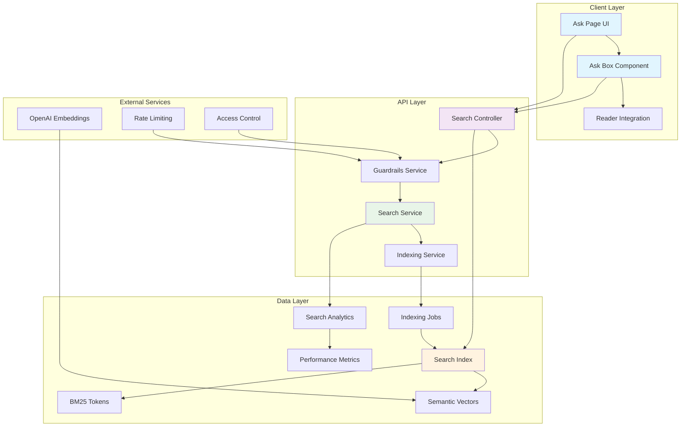

# Epic-05: AI-driven Semantic Search

## Overview

Epic-05 implements intelligent search capabilities that allow users to ask natural language questions about manual content and receive AI-powered answers with citations. The system uses hybrid search (vector embeddings + BM25) for accurate retrieval and implements comprehensive guardrails for security and access control.

## Features

### Core Capabilities

- **AI-Powered Q&A**: Ask natural language questions and receive concise, accurate answers
- **Hybrid Search**: Combines semantic vector search with BM25 keyword matching for optimal relevance
- **Intelligent Citations**: Provides specific paragraph citations with navigation links
- **Content Indexing**: Automated indexing of released content with semantic embeddings
- **Access Control**: Role-based access to draft vs. released content
- **Rate Limiting**: Prevents abuse with configurable request limits
- **Performance Monitoring**: Search analytics and performance tracking

### Search Architecture

The system uses a multi-layered approach:

1. **Content Ingestion**: Released snapshots are indexed with full-text content, metadata, and semantic vectors
2. **Query Processing**: Natural language queries are validated, rate-limited, and processed for search
3. **Hybrid Retrieval**: Combines vector similarity and keyword matching for optimal relevance
4. **Result Processing**: Filters results by access permissions and generates citations
5. **Answer Generation**: Creates contextual answers based on top matching content
6. **Analytics**: Logs search performance and user satisfaction metrics

## Technology Stack

### Vector Search
- **pgvector**: PostgreSQL extension for vector similarity search
- **Embeddings**: Placeholder for OpenAI/Claude embeddings (768-dimensional vectors)
- **Similarity Scoring**: Cosine similarity for semantic matching

### Search Engine
- **BM25**: Traditional keyword search for exact matches and synonyms
- **Tokenization**: Custom tokenizer with stop-word removal and stemming
- **Ranking**: Hybrid scoring combining semantic relevance and keyword matching

### Content Processing
- **TipTap JSON**: Parses rich text content from editor sessions
- **Text Extraction**: Converts structured content to searchable text
- **Metadata Extraction**: Captures hierarchy (chapter/section/paragraph) and citations

### Access Control
- **Role-Based**: EDITOR+ can access draft content, READERS only released
- **Organization Filtering**: Multi-tenant content isolation
- **Operational Critical**: Special handling for critical procedures

## API Endpoints

### Ask API
```http
POST /api/search/ask
```

**Request Body:**
```json
{
  "query": "What are the safety procedures for engine start?",
  "filters": {
    "manualId": "manual-123",
    "version": "1.2.0",
    "contentType": "PARAGRAPH",
    "organizationId": "org-456"
  },
  "limit":[3]
}
```

**Response:**
```json
{
  "answer": "Based on the manual content, engine start safety procedures include...",
  "citations": [
    {
      "paragraphId": "para-789",
      "manualId": "manual-123",
      "chapterNumber": "01",
      "sectionNumber": "01-03",
      "paragraphIndex": 1,
      "content": "Pre-flight inspection must verify...",
      "score": 0.92,
      "highlightStart": 0,
      "highlightEnd": 100,
      "anchorId": "paragraph-para-789"
    }
  ],
  "query": "What are the safety procedures for engine start?",
  "searchTimeMs": 245,
  "totalResults": 5,
  "hasMoreResults": true,
  "searchTechniques": ["HYBRID", "SEMANTIC", "BM25"]
}
```

### Indexing APIs
```http
POST /api/search/index/released  # Index released content
POST /api/search/index/recreate  # Full index recreation
GET /api/search/jobs/:jobId      # Job status
GET /api/search/jobs            # Recent jobs
```

## User Interface

### Ask Page (`/search/ask`)
- Full-featured search interface with query input
- Real-time search results with answer and citations
- Clickable citations that navigate to specific paragraphs
- Search performance metrics and techniques used

### Ask Box Component
- Slimline component for embedding in Reader pages
- Manual-filtered search for contextual queries
- Sheet UI with collapsible answer panel
- Quick access to sources and navigation

### Navigation Integration
- Citation clicks navigate to `/manuals/:id@vX.Y#anchor`
- Anchor-based scrolling to specific paragraphs
- Breadcrumb integration for chapter/section context

## Security & Access Control

### Guardrails Service

**Query Validation:**
- Minimum 3 characters, maximum 500 characters
- SQL injection protection (DROP, SELECT, INSERT patterns)
- XSS prevention (script tags, javascript: handlers)
- Content filtering for harmful patterns

**Rate Limiting:**
- 10 requests per minute per user/session/IP
- Sliding window with Redis-style counters
- Graceful degradation on service errors
- Differentiated limits by user role

**Access Control:**
- **Anonymous**: Released content only
- **READER**: Released content only
- **EDITOR**: Released + draft content
- **ADMIN**: All content + admin operations

**Organization Isolation:**
- Users can only search within their organization
- Cross-tenant content protection
- Manual-level access filtering

## Database Schema

### SearchIndex Model
```sql
CREATE TABLE search_index (
  id              INTEGER PRIMARY KEY,
  contentHash     VARCHAR UNIQUE,      -- Deduplication
  manualId        VARCHAR NOT NULL,    -- FK to manuals
  chapterId       VARCHAR NOT NULL,    -- FK to chapters
  sectionId       VARCHAR NOT NULL,    -- FK to sections
  paragraphId     VARCHAR,             -- FK to blocks
  version         VARCHAR NOT NULL,   -- Release version
  contentType     ContentType,        -- PARAGRAPH/SECTION/CHAPTER
  title           VARCHAR NOT NULL,    -- Display title
  content         TEXT NOT NULL,       -- Searchable text
  semanticVector  vector(768),        -- Optional embedding
  bm25Tokens      TEXT[],             -- Tokenized keywords
  wordCount       INTEGER,            -- Performance metric
  anchorIds       TEXT[],             -- Navigation anchors
  organizationId  VARCHAR NOT NULL,   -- FK to organizations
  isReleased      BOOLEAN DEFAULT true,-- Access control
  indexedAt       TIMESTAMP DEFAULT now()
);
```

### IndexingJob Model
```sql
CREATE TABLE indexing_jobs (
  id            INTEGER PRIMARY KEY,
  type          IndexingType,         -- FULL_RECREATE/INCREMENTAL/MANUAL_TRIGGER
  status        JobStatus,             -- PENDING/RUNNING/COMPLETED/FAILED
  progress      JSON,                  -- {totalItems, processedItems, failedItems, currentPhase}
  triggeredBy   VARCHAR NOT NULL,      -- User/system identifier
  startedAt     TIMESTAMP,
  completedAt   TIMESTAMP,
  errorMessage  TEXT,
  metadata      JSON
);
```

### SearchAnalytics Model
```sql
CREATE TABLE search_analytics (
  id             INTEGER PRIMARY KEY,
  query          TEXT NOT NULL,
  userId         VARCHAR,
  sessionId      VARCHAR,
  responseTimeMs INTEGER NOT NULL,
  resultCount    INTEGER NOT NULL,
  resultScores   FLOAT[],
  clickCount     INTEGER DEFAULT 0,
  outcome        SearchOutcome DEFAULT 'NO_CLICK',
  userAgent      VARCHAR,
  timestamp      TIMESTAMP DEFAULT now()
);
```

## Performance Considerations

### Indexing Performance
- **Incremental**: Process only new/changed content since last index
- **Batch Processing**: Process content in chunks to avoid memory issues
- **Database Optimization**: Proper indexing on frequently queried fields
- **Background Jobs**: Asynchronous indexing to avoid blocking operations

### Search Performance
- **Vector Indexing**: Efficient similarity search with pgvector
- **Result Caching**: Cache frequent queries and user preferences
- **Query Optimization**: Optimize database queries for common patterns
- **Connection Pooling**: Efficient database connection management

### Scalability
- **Horizontal Scaling**: Multiple API instances behind load balancer
- **Database Scaling**: Read replicas for search operations
- **Caching Layer**: Redis for frequently accessed data
- **CDN Integration**: Static content delivery optimization

## Testing Strategy

### Unit Tests
- Search service logic and query processing
- Guardrails validation and rate limiting
- Content indexing and parsing utilities
- Answer generation and citation extraction

### Integration Tests
- End-to-end search workflows
- Access control enforcement across roles
- Organization filtering and isolation
- Database operations and error handling

### Performance Tests
- Search response time benchmarks
- Concurrent request handling
- Database query performance optimization
- Memory usage and resource monitoring

### Load Tests
- High-volume concurrent searches
- Stress testing rate limiting
- Long-running index operations
- Memory leak detection

## Roadmap

### Phase 1 (Current)
- ✅ Basic hybrid search implementation
- ✅ Manual content indexing
- ✅ Ask API and citation system
- ✅ Access control and guardrails
- ✅ Basic UI components

### Phase 2 (Future)
- 🔄 OpenAI/Claude integration for embeddings
- 🔄 Advanced answer generation with LLM
- 🔄 Query suggestion and autocomplete
- 🔄 Advanced filtering and faceted search
- 🔄 Search result ranking improvements

### Phase 3 (Advanced)
- 🔄 Cross-manual semantic linking
- 🔄 Concept extraction and tagging
- 🔄 Personalized search results
- 🔄 Advanced analytics and insights
- 🔄 Search result export functionality

## Architecture Diagram



## Compliance & Standards

### Data Privacy
- User queries anonymized in analytics
- Organization data isolation enforced
- Search history not permanently stored (GDPR compliance)

### Security
- Input validation prevents injection attacks
- Rate limiting prevents abuse and DoS
- Access control enforces data isolation
- Audit logging for compliance monitoring

### Performance Standards
- < 500ms average response time for search queries
- 99.9% availability for search service
- Support for 1000+ concurrent users
- Horizontal scaling capabilities

## Monitoring & Observability

### Metrics
- Search query volume and patterns
- Response time percentiles (p50, p95, p99)
- Indexing job success/failure rates
- User satisfaction (click-through rates)

### Alerts
- Search service degradation
- Indexing job failures
- Rate limit violations
- Database performance issues

### Logging
- Structured search query logging
- Performance metrics collection
- Error tracking and debugging
- User behavior analytics

---

**Status**: ✅ Complete
**Version**: 1.0.0
**Next Epic**: Epic-06: Advanced Analytics & Reporting


