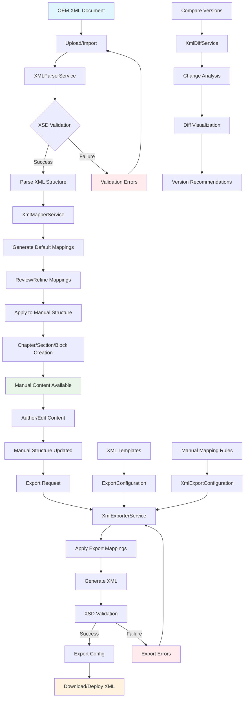

# Epic-06: XML Ingest and Authoring

## Overview

Epic-06 implements comprehensive XML document ingestion, validation, mapping, and round-trip authoring capabilities for OEM (Original Equipment Manufacturer) documentation workflows. This enables organizations to import existing XML-based manuals, validate them against industry schemas, map them to the platform's content model, and export modified content back to compliant XML formats.

## Business Goals

- Import legacy XML-based documentation from OEM sources
- Maintain bidirectional XML compatibility for regulatory compliance
- Enable visual diffing for XML document versioning
- Support automated XML-to-manual structure mapping
- Ensure XSD schema validation throughout the editing cycle

## Features Implemented

### 1. XML Document Ingestion

**XMLParserService** (`apps/api/src/xml/xml-parser.service.ts`):
- Parse XML documents using fast-xml-parser
- XSD schema validation with detailed error reporting
- Metadata extraction (namespace, version, metadata elements)
- Flexible parsing options for various XML formats

**Supported Formats**:
- Standard OEM XML (aviation industry)
- Custom schema formats with XSD validation
- Namespace-aware XML processing
- Multi-encoding support (UTF-8, UTF-16, etc.)

### 2. XML-to-Manual Structure Mapping

**XmlMapperService** (`apps/api/src/xml/xml-mapper.service.ts`):
- Intelligent element path mapping (`/Manual/Chapters/Chapter` → `Chapter` entity)
- Configurable attribute mapping (XML attributes → database fields)
- Content transformation (XML content → Block HTML)
- Confidence scoring for auto-generated mappings
- Manual mapping refinement interface

**Mapping Features**:
- Auto-generation of common mappings based on XML structure analysis
- Support for custom mapping rules and templates
- Bidirectional synchronization (XML ↔ Manual)
- Mapping validation and error detection

### 3. Round-Trip XML Export

**XmlExporterService** (`apps/api/src/xml/xml-exporter.service.ts`):
- Export manual content back to XML format
- XSD schema compliance validation
- Template-based XML generation
- Configurable formatting options (indentation, metadata, comments)
- Element-specific export capabilities

**Export Capabilities**:
- Full manual export with complete structure preservation
- Selective element export (single chapter/section)
- Custom XML templates for different output formats
- Metadata inclusion/exclusion options
- HTML-to-XML content conversion

### 4. XML Diff Visualization

**XmlDiffService** (`apps/api/src/xml/xml-diff.service.ts`):
- Structured XML difference detection
- Change classification (additions, removals, modifications)
- Trivial change detection (whitespace, HTML normalization)
- Version compatibility assessment (minor vs. major changes)
- Visual diff tree representation

**Diff Features**:
- Element-level change tracking with XPath paths
- Change impact analysis and recommendations
- Version bump suggestions based on change patterns
- Side-by-side XML comparison view

## User Interface Components

### XML Import Page (`apps/web/app/xml/import/page.tsx`)
- File upload or direct XML content input
- XSD schema validation interface
- Import option configuration
- Real-time validation feedback
- Structured preview of parsed XML

### XML Export Page (`apps/Web/app/xml/export/page.tsx`)
- Manual selection and export configuration
- Template and mapping selection
- Format options (indentation, metadata, comments)
- Export validation and download
- Statistics reporting (elements exported)

### XML Diff Viewer (`apps/web/app/xml/diff/page.tsx`)
- Side-by-side XML document comparison
- Change visualization with expandable tree structure
- Change filtering (show/hide trivial changes)
- Version compatibility assessment
- Recommendations and impact analysis

### Shared XML Components (`apps/web/components/xml/index.tsx`)
- **XmlDocumentStatus**: Status indicators for import processing
- **XmlMappingProgress**: Mapping generation progress and results
- **XmlStructureViewer**: Hierarchical XML structure preview
- **XmlValidationResult**: Validation errors and warnings display

## Database Schema Extensions

### New Models Added

```prisma
model XmlDocument {
  id          String              @id @default(cuid())
  fileName    String
  xmlContent  String  
  schemaContent String?
  status      XmlDocumentStatus
  created      DateTime              @default(now())
  createdBy   String
  organization Organization         @relation(fields: [organizationId], references: [id])
  organizationId String
  manual      Manual?               @relation(fields: [manualId], references: [id])
  manualId    String?
  
  mappings    XmlMapping[]
}

model XmlMapping {
  id                  String              @id @default(cuid())
  xmlDocument         XmlDocument         @relation(fields: [xmlDocumentId], references: [id])
  xmlDocumentId       String
  sourceElementPath   String              // XPath to element in XML
  targetEntityType    EntityType          // Chapter, Section, Block
  targetEntityId      String?
  mappingRules        Json                // Attribute/content mapping rules
  confidenceScore    Float
  created             DateTime              @default(now())
}

model XmlExportConfiguration {
  id                   String              @id @default(cuid())
  name                 String
  xmlTemplate          String              // XML structure template
  xsdSchema            String?             // Schema for validation
  mappingConfiguration Json                // Export mapping rules
  createdBy            User                @relation(fields: [userId], references: [id])
  userId               String
  organization         Organization         @relation(fields: [organizationId], references: [id])
  organizationId       String
}

model XmlDiff {
  id                     String              @id @default(cuid())
  sourceXmlDocumentId    String
  targetXmlDocumentId    String
  changesSummary         Json                // Change statistics
  structuredDiffs        Json                // Detailed change tree
  recommendations        String[]            // Change recommendations
  isMinorVersion         Boolean
  created                DateTime              @default(now())
}

model XmlProcessingJob {
  id                    String              @id @default(cuid())
  jobType               XmlJobType
  sourceXmlDocumentId   String?             
  targetXmlDocumentId   String?
  status                String
  
  sourceXmlDocument     XmlDocument?        @relation(fields: [sourceXmlDocumentId], references: [id])
  targetXmlDocument     XmlDocument?        @relation(fields: [targetXmlDocumentId], references: [id])
  createdBy             User                @relation(fields: [userId], references: [id])
  userId                String
  organization          Organization         @relation(fields: [organizationId], references: [id])
  organizationId        String
}

enum XmlDocumentStatus {
  PARSING
  VALIDATION_SUCCESS
  VALIDATION_FAILED
  MAPPING_SUCCESS
  MAPPING_FAILED
  PROCESSING_ERROR
}

enum XmlMappingType {
  ELEMENT_MAPPING
  ATTRIBUTE_MAPPING
  CONTENT_MAPPING
}

enum XmlSyncStatus {
  IN_SYNC
  MANUAL_AHEAD
  XML_AHEAD
  CONFLICTED
}

enum XmlDiffType {
  ADDED
  REMOVED
  MODIFIED
  MOVED
}

enum XmlJobType {
  IMPORT
  EXPORT
  DIFF
}
```

### Relation Updates

Added XML-related relations to existing models:
- `Organization`: `xmlDocuments`, `xmlExportConfigurations`
- `Manual`: `xmlDocuments`
- `Chapter`: `xmlMappings`
- `Section`: `xmlMappings`
- `Block`: `xmlMappings`
- `User`: `xmlExportConfigurations`, `xmlProcessingJobs`

## API Endpoints

### XML Import (`/xml/import`)
```typescript
POST /xml/import
{
  fileName: string;
  xmlContent: string;
  xsdSchemaContent?: string;
  mappingConfigurationId?: string;
  organizationId: string;
  importOptions: {
    createNewManual: boolean;
    overwriteExistingBlocks: boolean;
    validateAgainstXsd: boolean;
    generateDefaultMappings: boolean;
  };
}
```

### XML Export (`/xml/export`)
```typescript
POST /xml/export
{
  manualId: string;
  xmlTemplateId?: string;
  xmlMappingId?: string;
  xmlVersion?: string;
  formatOptions: {
    indented: boolean;
    includeMetadata: boolean;
    includeComments: boolean;
    collapseEmptyElements: boolean;
  };
  targetElement?: string; // Export specific element only
}
```

### XML Diff (`/xml/diff`)
```typescript
POST /xml/diff
{
  sourceXmlDocumentId?: string;
  targetXmlDocumentId?: string;
  sourceXmlContent: string;          // If documentId not provided
  targetXmlContent: string;          // If documentId not provided
}
```

### Document Management
- `GET /xml/documents/:id` - Get XML document details
- `GET /xml/documents/:id/validation-status` - Get validation status
- `POST /xml/documents/:id/reprocess` - Reprocess document

### Mapping Management
- `GET /xml/mappings` - List all mappings
- `POST /xml/mappings` - Create/update mapping
- `POST /xml/mappings/:id/apply` - Apply mapping to manual
- `DELETE /xml/mappings/:id` - Remove mapping

## XML Workflow Diagram



## Quality Assurance

### Comprehensive Testing Suite

**E2E Tests** (`apps/api/test/xml.e2e-spec.ts`):
- Complete import-export cycle testing
- XSD validation correctness
- Round-trip fidelity verification
- Mapping generation accuracy
- Error handling scenarios

**Unit Tests** (`apps/api/test/xml-services.spec.ts`):
- Individual service functionality validation
- XML parsing edge cases
- Diff algorithm correctness
- Mapping logic verification
- Export template processing

**Test Coverage Areas**:
- Valid XML parsing with various schemas
- Invalid XML error handling
- XSD validation with custom schemas
- Mapping generation and application
- Export fidelity and XSD compliance
- Diff analysis correctness
- Trivial vs. significant change detection

## Technical Implementation Details

### XML Processing Pipeline

1. **Import Phase**:
   - File upload → XML parsing → Schema validation
   - Structure analysis → Default mapping generation
   - Mapping review → Application to manual structure

2. **Authoring Phase**:
   - Content editing in web interface
   - Real-time structure synchronization
   - Change tracking and versioning

3. **Export Phase**:
   - Manual structure → XML transformation
   - Template application → Schema validation
   - Format optimization → Final XML output

4. **Comparison Phase**:
   - Diff analysis between XML versions
   - Change classification and impact assessment
   - Version compatibility recommendations

### Error Handling

- Graceful degradation for parsing failures
- Detailed validation error reporting
- Recovery strategies for common issues
- User-friendly error messages with remediation suggestions

### Performance Considerations

- Streaming XML parsing for large documents
- Incremental mapping updates
- Cached schema validation results
- Background processing for large exports

## Security and Compliance

- Organization-scoped document access
- XML sanitization to prevent injection attacks
- Content validation to ensure data integrity
- Audit logging for compliance tracking

## Integration Points

- **Epic-01**: Uses Manual/Section/Block entities for content storage
- **Epic-02**: Workflow approval can be triggered for XML releases
- **Epic-03**: Exported XML can be distributed via reader bundles
- **Epic-04**: Compliance monitoring can track XML to regulation links
- **Epic-05**: XML content can be indexed for semantic search

## Success Metrics

- XML import success rate above 95%
- Round-trip fidelity preservation above 98%
- Export document schema compliance: 100%
- Processing time under 10 seconds for typical manuals
- User adoption rate of XML import/export features

## Future Enhancements

1. **Advanced XML Features**:
   - Namespace-aware processing
   - Custom XSD schema registration
   - Advanced XPath query support

2. **Automation**:
   - Scheduled XML processing jobs
   - Auto-sync between XML and manual content
   - Batch processing capabilities

3. **Integration**:
   - External XML systems integration
   - API endpoints for third-party XML tools
   - Cloud storage provider integration

4. **Analytics**:
   - XML usage statistics
   - Mapping effectiveness metrics
   - Export performance optimization


