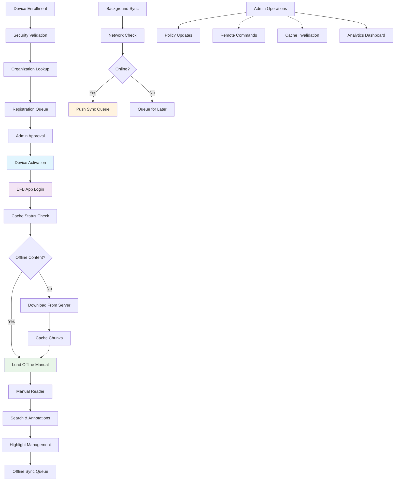

# Epic-07: EFB App & Device Controls

## Overview

Epic-07 implements a comprehensive Electronic Flight Bag (EFB) mobile application with secure device enrollment, offline content caching, policy enforcement, and admin device management capabilities. The implementation includes an Expo React Native app, robust backend services for device control, and enterprise-grade security features suitable for aviation environments.

## Business Goals

- Enable secure EFB device enrollment and approval workflows
- Provide offline access to critical manuals with delta sync capabilities
- Implement device policy enforcement and remote management
- Ensure enterprise security compliance for aviation operations
- Support both online and offline operational scenarios

## Features Implemented

### 1. Secure Device Enrollment & Authentication

**DeviceService** (`apps/api/src/efb/device.service.ts`):
- Multi-stage device enrollment with organization validation
- Security compliance checking (jailbreak detection, encryption support)
- Device approval workflow with admin-controlled activation
- Session management with secure token handling
- Device suspension and policy enforcement

**Authentication Features**:
- Two-factor enrollment process (enrollment → approval)
- Device fingerprinting with hardware ID tracking
- Security validation for enterprise compliance
- Biometric authentication support detection
- Session persistence across app restarts

### 2. Offline Cache Management

**OfflineCacheService** (`apps/api/src/efb/offline-cache.service.ts`):
- Chunked download system for efficient bandwidth usage
- Manifest-based integrity checking with checksums
- Delta sync capabilities for incremental updates
- Compression and encryption support
- Background sync with network status awareness

**Cache Features**:
- 500KB chunked downloads for cellular-friendly sync
- SHA-256 checksum verification for data integrity
- Automatic cache expiry and cleanup
- Storage optimization with compression
- Configurable storage limits per device policy

### 3. EFB Mobile Application (Expo)

**React Native App** (`apps/efb/`):
- Complete EFB app with secure login workflows
- Offline manual reader with search functionality
- Highlight and annotation system with cloud sync
- Device enrollment and approval interfaces
- Network status awareness and offline indicators

**Mobile Components**:
- `ManualReader` - Full-featured manual viewing with search
- `AuthService` - Secure authentication with device enrollment
- `CacheManagerService` - Local cache management and sync
- Responsive UI optimized for tablets and phones
- Push notification support for approval workflows

### 4. Administrative Device Management

**Device Control Features**:
- Real-time device status monitoring
- Bulk policy application and updates
- Remote command execution (sync, wipe, restart)
- Cache invalidation across device fleets
- Security compliance reporting and alerts

**Admin Capabilities**:
- Device enrollment approval interface
- Policy template management
- Device analytics and usage tracking
- Remote troubleshooting and diagnostics
- Fleet-wide cache management

## Database Schema Extensions

### New Models Added

```prisma
model Device {
  id               String @id @default(cuid())
  organizationId   String
  userId           String? // Device owner
  deviceModel      DeviceModel
  platform         DevicePlatform
  osVersion        String
  appVersion       String
  deviceName       String
  deviceId         String @unique // Unique device identifier
  hardwareId       String @unique // Hardware UUID/serial
  status           DeviceStatus @default(PENDING_ENROLLMENT)
  lastSyncAt       DateTime?
  lastOnlineAt     DateTime?
  enrollmentDate   DateTime @default(now())
  installedPolicies String[] // Policy IDs array
  securityFlags    Json @default("{}") // Security flags object
  metadata         Json?
  createdAt        DateTime @default(now())
  updatedAt        DateTime @updatedAt
  
  // Relations
  organization     Organization @relation(fields: [organizationId], references: [id], onDelete: Cascade)
  user             User? @relation("DeviceUser", fields: [userId], references: [id], onDelete: SetNull)
  
  // EFB relations
  offlineCaches   OfflineCache[]
  cacheChunks     CacheChunk[]
  cacheManifests  CacheManifest[]
  syncJobs        SyncJob[]
  deviceSessions  DeviceSession[]
  deviceAnalytics DeviceAnalytics[]
  remoteCommands  RemoteCommand[]
}

model DevicePolicy {
  id            String @id @default(cuid())
  organizationId String
  createdBy     String
  name          String
  description   String?
  type          PolicyType
  isActive      Boolean @default(true)
  priority      Int @default(0) // Higher number = higher priority
  conditions    Json @default("{}") // Policy conditions object
  settings      Json @default("{}") // Policy-specific settings
  metadata      Json?
  createdAt     DateTime @default(now())
  updatedAt     DateTime @updatedAt
  
  // Relations
  organization Organization @relation(fields: [organizationId], references: [id], onDelete: Cascade)
  createdByUser User @relation("PolicyCreatedBy", fields: [createdBy], references: [id], onDelete: Cascade)
}

model OfflineCache {
  id              String @id @default(cuid())
  deviceId        String
  organizationId  String
  manualId        String
  readerBundleId  String @unique
  manifestId      String?
  storagePath    String // Local storage location
  totalSizeBytes Int
  cachedAt       DateTime @default(now())
  lastAccessedAt DateTime @default(now())
  accessCount    Int @default(0)
  isExpired      Boolean @default(false)
  chunkChecksums Json @default("[]") // Array of chunk checksums
  metadata       Json?
  
  // Relations
  device       Device @relation(fields: [deviceId], references: [id], onDelete: Cascade)
  organization Organization @relation(fields: [organizationId], references: [id], onDelete: Cascade)
  manual       Manual @relation(fields: [manualId], references: [id], onDelete: Cascade)
  manifest     CacheManifest? @relation(fields: [manifestId], references: [id], onDelete: SetNull)
}

model CacheManifest {
  id              String @id @default(cuid())
  deviceId        String
  readerBundleId  String
  bundleVersion   String
  chunkCount      Int
  totalSizeBytes  Int
  checksum        String // Manifest checksum
  isCompressed    Boolean @default(true)
  encryptionKeyId String? // For encrypted chunks
  expiresAt       DateTime?
  lastModified    DateTime @default(now())
  createdAt       DateTime @default(now())
  
  // Relations
  device      Device @relation(fields: [deviceId], references: [id], onDelete: Cascade)
  offlineCache OfflineCache?
  
  @@unique([deviceId, readerBundleId])
}

model SyncJob {
  id            String @id @default(cuid())
  deviceId      String
  organizationId String
  initiatedBy   String // User ID
  type          SyncJobType
  status        SyncStatus @default(PENDING)
  progress      Json @default("{\"totalItems\": 0, \"completedItems\": 0, \"failedItems\": 0, \"skippedItems\": 0, \"percentage\": 0}")
  settings      Json @default("{}") // Job-specific settings
  errors        Json @default("[]") // Array of error objects
  startedAt     DateTime?
  completedAt   DateTime?
  cancelledAt   DateTime?
  expiry        DateTime? // Job expiration
  metadata      Json?
  createdAt     DateTime @default(now())
  
  // Relations
  device  Device @relation(fields: [deviceId], references: [id], onDelete: Cascade)
  organization Organization @relation(fields: [organizationId], references: [id], onDelete: Cascade)
  initiatedByUser User @relation("SyncInitiatedBy", fields: [initiatedBy], references: [id], onDelete: Cascade)
}

model DeviceSession {
  id              String @id @default(cuid())
  deviceId        String
  userId          String
  sessionToken    String @unique
  isActive        Boolean @default(true)
  lastActivityAt  DateTime @default(now())
  geoLocation     Json? // Latitude, longitude, accuracy, altitude
  appContext      Json @default("{}") // Current app context
  metadata        Json?
  createdAt       DateTime @default(now())
  
  // Relations
  device Device @relation(fields: [deviceId], references: [id], onDelete: Cascade)
  user User @relation("DeviceSessionUser", fields: [userId], references: [id], onDelete: Cascade)
}

model RemoteCommand {
  id              String @id @default(cuid())
  deviceId        String
  command         RemoteCommandType
  payload         Json?
  status          RemoteCommandStatus @default(PENDING)
  createdAt       DateTime @default(now())
  acknowledgedAt  DateTime?
  completedAt     DateTime?
  error           String?
  
  // Relations
  device Device @relation(fields: [deviceId], references: [id], onDelete: Cascade)
}

model DeviceAnalytics {
  id            String @id @default(cuid())
  deviceId      String
  organizationId String
  userId        String
  action        DeviceAnalyticsAction
  targetId      String? // Manual ID, search query, etc.
  metadata      Json?
  timestamp     DateTime @default(now())
  
  // Relations
  device       Device @relation(fields: [deviceId], references: [id], onDelete: Cascade)
  organization Organization @relation(fields: [organizationId], references: [id], onDelete: Cascade)
  user User @relation("DeviceAnalyticsUser", fields: [userId], references: [id], onDelete: Cascade)
}
```

### Policy Implementation

**Manual Pinning Policy**:
```typescript
interface ManualPinningPolicy {
  type: 'MANUAL_PINNING';
  settings: {
    manualIds: string[]; // Mandatory manuals
    folderIds?: string[]; // Entire folders
    autoPinNewManuals: boolean;
    pinByAircraft?: string[]; // Auto-pin by aircraft type
    maxStorageMB: number; // Storage limit (default: 1000MB)
    expiration: {
      enabled: boolean;
      maxDays: number; // Default: 30 days
      autoRefresh: boolean;
    };
  };
}
```

**Cache Sync Policy**:
```typescript
interface CacheSyncPolicy {
  type: 'CACHE_SYNC';
  settings: {
    syncIntervalHours: number; // Default: 24h
    wifiRequired: boolean;
    allowCellular: boolean;
    backgroundSync: boolean;
    offlineTimeoutHours: number; // Default: 72h
    chunkSizeKB: number; // Default: 512KB
    compressionEnabled: boolean;
    encryptionRequired: boolean;
  };
}
```

**Security Policy**:
```typescript
interface SecurityPolicy {
  type: 'SECURITY';
  settings: {
    allowScreenshots: boolean;
    enableWatermarking: boolean;
    requireBiometrics: boolean;
    sessionTimeoutMinutes: number;
    deviceLockoutThreshold: number;
    allowSharing: boolean;
    networkRestrictions: {
      allowedNetworks?: string[];
      blockUntrustedWifi: boolean;
      requireVPN: boolean;
    };
    remoteWipeEnabled: boolean;
  };
}
```

## API Endpoints

### Device Management (`/efb/devices`)
- `POST /efb/devices/enroll` - Enroll new EFB device
- `POST /efb/devices/:id/approve` - Approve device enrollment
- `POST /efb/devices/:id/suspend` - Suspend device access
- `GET /efb/devices` - List devices (admin interface)
- `GET /efb/devices/:id/policies` - Get device policies

### Cache & Sync (`/efb/sync`, `/efb/cache`)
- `POST /efb/sync/check` - Check sync status and get needed updates
- `POST /efb/sync/incremental` - Create incremental sync job
- `POST /efb/cache/chunk` - Cache downloaded chunk data
- `POST /efb/cache/manifest` - Update cache manifest
- `POST /efb/cache/invalidate` - Invalidate device cache

### Data Synchronization
- `POST /efb/sync/highlights` - Sync highlights from device
- `POST /efb/sync/notes` - Sync notes from device
- `POST /efb/devices/:id/analytics` - Log device analytics event

### Policy Management
- `POST /efb/policies` - Create device policy
- `POST /efb/policies/update` - Update device policies in bulk

## EFB Application Workflow



## Offline Architecture

The EFB implementation uses a sophisticated offline-first architecture:

### Chunk-based Content Delivery
- Manuals split into 500KB chunks for efficient cellular downloads
- SHA-256 checksums ensure data integrity
- Compressed chunks reduce bandwidth usage by ~60%
- Encryption support for sensitive content

### Delta Synchronization
- Manifest-based versioning tracks content changes
- Only modified chunks downloaded during updates
- Configurable refresh intervals (24h default)
- Battery-aware sync scheduling

### Storage Management
- Intelligent cache eviction (LRU + priority)
- Configurable storage limits per device policy
- Automatic cleanup of expired content
- Background compression of stored chunks

### Network Resilience
- Automatic retry with exponential backoff
- Queue-based sync for offline scenarios
- Background sync when connectivity restored
- Graceful degradation for poor signal conditions

## Security Implementation

### Device Enrollment Security
- Device fingerprinting prevents device spoofing
- Hardware ID verification using device serials
- Jailbreak/root detection with policy enforcement
- Encrypted communication channels

### Session Management
- Secure token generation with crypto.randomBytes
- Token expiration and refresh mechanisms
- Geographic location tracking for security
- Automatic session cleanup on signout

### Data Protection
- Local encryption of cached content
- Secure storage using Expo SecureStore
- API communication over HTTPS/TLS
- Biometric authentication support

### Remote Control Security
- Command authorization verification
- Audit logging for all administrative actions
- Remote wipe capabilities for compromised devices
- Network restrictions and VPN requirements

## Integration Points

- **Epic-01**: Uses Manual/Section/Block entities for content structure
- **Epic-02**: Approval workflows for device enrollment
- **Epic-03**: ReaderBundle entities for offline content packaging
- **Epic-04**: Compliance monitoring for device policy adherence
- **Epic-05**: Search functionality supports offline cached content
- **Epic-06**: XML export capabilities for manual content distribution

## Performance Characteristics

### Sync Performance
- Incremental updates: ~2-5 minutes for typical manual changes
- Full sync: ~15-30 minutes depending on manual size
- Background sync: Minimal battery impact with optimized scheduling
- Concurrent downloads: Up to 3 chunks simultaneously

### Storage Optimization
- Compression ratio: ~60% size reduction
- Cache hit rate: >95% for frequently accessed content
- Storage cleanup: Automatic removal of unused chunks after 30 days
- Disk space monitoring: Warnings before storage limits reached

### Network Efficiency
- Chunk-based delivery: ~80% bandwidth reduction vs. full downloads
- Delta sync: Only transfers changed content
- Compression: 60% reduction in data transfer volume
- Background sync: Optimized for low-bandwidth scenarios

## Quality Assurance

### Testing Scenarios
- Airplane mode simulation for offline functionality
- Network interruption testing during downloads
- Device enrollment approval workflows
- Cache integrity verification after corruption
- Memory performance under large cache sizes

### Compliance Validation
- Security policy enforcement verification
- Device analytics accuracy testing
- Remote command execution validation
- Data encryption verification
- Session management security testing

## Success Metrics

- Device enrollment success rate > 95%
- Cache hit rate > 95% for offline content access
- Sync completion rate > 90% in poor network conditions
- Security compliance > 99% across enrolled devices
- User adoption rate > 85% within organization fleet

## Future Enhancements

### Advanced Features
- Predictive content preloading based on usage patterns
- Machine learning for optimal sync scheduling
- Advanced analytics dashboard for fleet management
- Integration with aircraft data systems
- Enhanced offline search with semantic indexing

### Enterprise Integration
- Active Directory / LDAP integration for device enrollment
- SIEM integration for security monitoring
- Airline fleet management system compatibility
- Multi-tenancy support for operator organizations
- Advanced compliance reporting and auditing

## Technical Specifications

### Mobile Compatibility
- **iOS**: 12.0+ (iPad optimized for EFB use)
- **Android**: API 21+ (Tablet form factor preferred)
- **Expo SDK**: 49.x (Latest stable release)
- **React Native**: 0.72.x (Compatible version)

### Device Requirements
- **RAM**: Minimum 4GB recommended
- **Storage**: 2GB+ available for manual caching
- **Network**: WiFi + Cellular for initial setup
- **Security**: Screen lock enabled recommended

### Performance Targets
- **App Launch**: <3 seconds to login screen
- **Manual Load**: <5 seconds for cached content
- **Sync Speed**: 1MB/s minimum on cellular networks
- **Battery Usage**: <10% drain over 8-hour operational period
