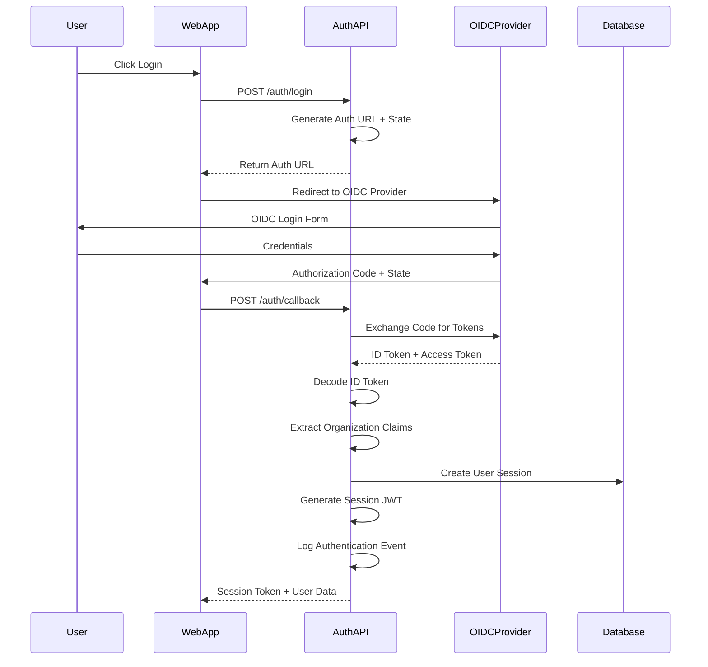
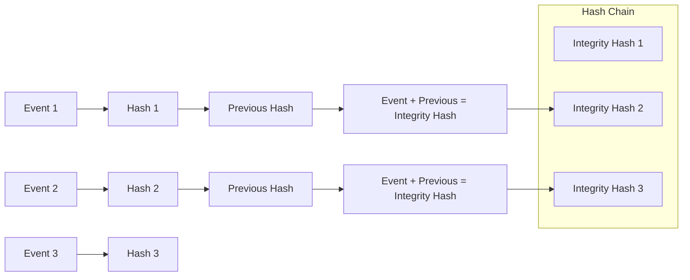

# Epic-08: User/Admin Management & Audit

## Overview

Epic-08 implements comprehensive Identity and Access Management (IAM) with structured audit logging for SkyManuals. This epic delivers enterprise-grade authentication, authorization, and compliance auditing capabilities.

## Features Implemented

### 🔐 OIDC Authentication
- **Multi-Provider Support**: Auth0, Azure Entra, Keycloak, and custom OIDC providers
- **JWT Token Management**: Secure session tokens with organization+role claims
- **Organization Context**: Automatic organization context switching with `x-org-id` middleware
- **Session Management**: Secure session creation, validation, and termination

### 🛡️ RBAC Framework
- **Permission-Based Authorization**: Granular permission system with 4 role levels (ADMIN, EDITOR, REVIEWER, READER)
- **Guards & Middleware**: Multiple security guards for authentication, permissions, organization context, and resource access
- **Declarative Permissions**: `@RequirePermissions()` decorators for controller methods
- **Permission Inheritance**: Admin users automatically inherit all permissions

### 📊 Audit System
- **Structured Audit Logging**: Comprehensive field coverage (who/when/what/before/after)
- **Integrity Hash Chain**: Cryptographic chain verification prevents tampering
- **Event Types**: Authentication, authorization, data access/modification/deletion, security events
- **Export Capabilities**: JSON, CSV, Excel export with filtering

### 👥 Admin UI
- **Organization Switcher**: Seamless organization context switching
- **Role Management**: Bulk role operations and individual user role management
- **Approval Workflows**: Review and approve role change requests
- **Permission Matrix**: Visual permission matrix management

## Architecture

### Authentication Flow



### RBAC Permission Matrix

```mermaid
graph TD
    A[ADMIN Role] --> A1[All Permissions<br/>27/27]
    A --> A2[User Management]
    A --> A3[Organization Settings]
    A --> A4[Audit Export]
    A --> A5[Device Management]
    
    E[EDITOR Role] --> E1[Content Permissions<br/>16/27]
    E --> E2[Manuals: Read/Write/Publish]
    E --> E3[Chapters: Read/Write]
    E --> E4[Workflows: Execute]
    
    R[REVIEWER Role] --> R1[Review Permissions<br/>9/27]
    R --> R2[Content: Read Only]
    R --> R3[Workflows: Approve]
    R --> R4[Limited Write Access]
    
    RD[READER Role] --> RD1[Read Permissions<br/>6/27]
    RD --> RD2[Content: Read Only]
    RD --> RD3[Search Access]
    RD --> RD4[XML: Read]
```



### Audit Hash Chain Integrity



## Implementation Details

### Core Components

#### 1. OIDC Service (`apps/api/src/auth/oidc.service.ts`)
- Manages OIDC integration with multiple providers
- Handles token exchange and session creation
- Organization context management
- Permission extraction from JWT claims

#### 2. Security Guards (`apps/api/src/auth/auth.guard.ts`)
- **AuthGuard**: Validates JWT session tokens
- **PermissionsGuard**: Checks required permissions
- **OrganizationGuard**: Enforces organization context
- **ResourceAccessGuard**: Validates resource-level access
- **SecurityGuard**: Combined guard for all security checks

#### 3. Audit Service (`apps/api/src/audit/audit.service.ts`)
- Comprehensive audit event logging
- Automatic integrity hash calculation
- Support for before/after data snapshots
- Export functionality with filtering

#### 4. Admin UI Components
- **OrgSwitcher**: Organization context switching
- **UserProfile**: User session management
- **UserManagement**: Role and permission management

### Database Schema

#### New Models Added
```sql
-- Epic-08 Models
CREATE TABLE user_session (
  id TEXT PRIMARY KEY,
  user_id TEXT NOT NULL,
  session_id TEXT UNIQUE NOT NULL,
  client_id TEXT NOT NULL,
  issuer VARCHAR NOT NULL,
  organization_context TEXT NOT NULL,
  permissions TEXT[] NOT NULL,
  expires_at TIMESTAMP NOT NULL,
  created_at TIMESTAMP DEFAULT NOW(),
  updated_at TIMESTAMP DEFAULT NOW()
);

CREATE TABLE audit_log (
  id TEXT PRIMARY KEY,
  request_id TEXT NOT NULL,
  user_id TEXT,
  organization_id TEXT,
  event_type VARCHAR NOT NULL,
  action TEXT NOT NULL,
  resource TEXT NOT NULL,
  severity VARCHAR DEFAULT 'MEDIUM',
  integrity_hash TEXT NOT NULL,
  previous_hash TEXT,
  before_data JSONB,
  after_data JSONB,
  created_at TIMESTAMP DEFAULT NOW()
);

CREATE TABLE permission_matrix (
  id TEXT PRIMARY KEY,
  organization_id TEXT NOT NULL,
  role VARCHAR NOT NULL,
  permissions BIGINT NOT NULL,
  limitations TEXT[],
  UNIQUE(organization_id, role)
);
```

## Security Features

### 🔒 Authentication Security
- **OIDC Standard**: Industry-standard authentication flow
- **JWT Validation**: Cryptographic token verification
- **Session Expiration**: Automatic session cleanup
- **CSRF Protection**: State parameter validation

### 🛡️ Authorization Security
- **Principle of Least Privilege**: Minimal required permissions
- **Role-Based Access Control**: Hierarchical permission model
- **Resource-Level Security**: Individual resource access validation
- **Guard Chaining**: Multiple security layers

### 📋 Audit Security
- **Immutable Logs**: Integrity hash chain prevents tampering
- **Comprehensive Coverage**: All user actions logged
- **Hash Verification**: Cryptographic integrity verification
- **Export Controls**: Secure audit data export

## Usage Examples

### Protecting API Endpoints

```typescript
@Controller('manuals')
@UseGuards(SecurityGuard)
export class ManualController {
  
  @Post()
  @RequirePermissions('manual:write')
  @ResourceType('Manual')
  async createManual(@Body() data: CreateManualRequest) {
    // Controller logic
  }
  
  @Get()
  @RequirePermissions('manual:read')
  async getManuals() {
    // Controller logic  
  }
  
  @Delete(':id')
  @RequirePermissions('manual:delete')
  @ResourceType('Manual')
  @ResourceId('id')
  async deleteManual(@Param('id') id: string) {
    // Controller logic
  }
}
```

### Custom Audit Logging

```typescript
@Injectable()
export class ManualService {
  constructor(private auditService: AuditService) {}

  async updateManual(id: string, data: UpdateManualRequest, context: RequestContext) {
    const beforeData = await this.getManualData(id);
    
    const updatedManual = await this.prisma.manual.update({
      where: { id },
      data,
    });

    await this.auditService.logDataModification(
      context,
      'UPDATE',
      'Manual',
      id,
      'Manual' as ResourceType,
      beforeData,
      updatedManual,
    );

    return updatedManual;
  }
}
```

### Client-Side Organization Management

```typescript
// Organization switching
const handleOrgSwitch = async (organizationId: string) => {
  const response = await fetch('/api/auth/switch-organization', {
    method: 'POST',
    headers: {
      'Authorization': `Bearer ${sessionToken}`,
      'Content-Type': 'application/json',
    },
    body: JSON.stringify({
      session_token: sessionToken,
      organization_id: organizationId,
      client_id: clientId,
    }),
  });

  const newSession = await response.json();
  localStorage.setItem('session_token', newSession.sessionToken);
};
```

## Testing Strategy

### Permission Matrix Testing
- **Role-Based Tests**: Verify each role has correct permissions
- **Inheritance Tests**: Confirm ADMIN inherits all permissions
- **Escalation Prevention**: Block unauthorized privilege escalation
- **Cross-Resource Tests**: Validate permissions across different resource types

### Audit Integrity Testing
- **Hash Chain Verification**: Confirm integrity chain remains unbroken
- **Tamper Detection**: Detect and reject modified audit events
- **Export Validation**: Verify audit export completeness and format
- **Security Event Coverage**: Ensure all security events are logged

## Deployment Considerations

### Environment Variables
```bash
# OIDC Configuration
AUTH0_DOMAIN=your-domain.auth0.com
AUTH0_CLIENT_ID=your-auth0-client-id
AUTH0_CLIENT_SECRET=your-auth0-client-secret

ENTRA_TENANT_ID=your-azure-tenant
ENTRA_CLIENT_ID=your-azure-client-id
ENTRA_CLIENT_SECRET=your-azure-client-secret

# JWT Configuration
JWT_SECRET=your-super-secret-jwt-key
JWT_EXPIRES_IN=86400

# Audit Configuration
AUDIT_RETENTION_DAYS=2555  # 7 years for compliance
AUDIT_EXPORT_ENABLED=true
```

### Security Gate Checklist
- [ ] OIDC credentials configured
- [ ] JWT secrets secured
- [ ] Session cleanup scheduled
- [ ] Audit log rotation configured
- [ ] Permission matrix seeded
- [ ] Security guard enabled globally
- [ ] Organization middleware activated

## Data Privacy & Compliance

### GDPR Compliance
- **Data Minimization**: Collect only necessary user data
- **Purpose Limitation**: Use data only for stated purposes
- **Transparency**: Clear audit trail of all data processing

### SOX Compliance
- **Immutable Audit Trail**: Tamper-proof audit logs
- **Access Controls**: Strong RBAC implementation
- **Separation of Duties**: Role-based access limitations

### SOC 2 Type II
- **Data Integrity**: Cryptographic audit integrity
- **Availability**: Session management and cleanup
- **Confidentiality**: Encrypted token storage

---

## Summary

Epic-08 delivers enterprise-grade IAM and audit capabilities with:

✅ **Complete OIDC Authentication Flow**  
✅ **Granular RBAC Permission System**  
✅ **Cryptographically Secure Audit Logging**  
✅ **Admin UI for User & Role Management**  
✅ **Comprehensive Security Testing**  
✅ **Enterprise Compliance Ready**

This epic establishes SkyManuals as an enterprise-ready platform with security, compliance, and audit capabilities suitable for regulated industries like aviation.


