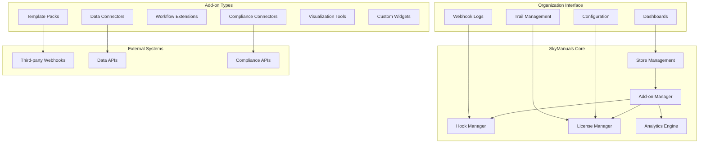
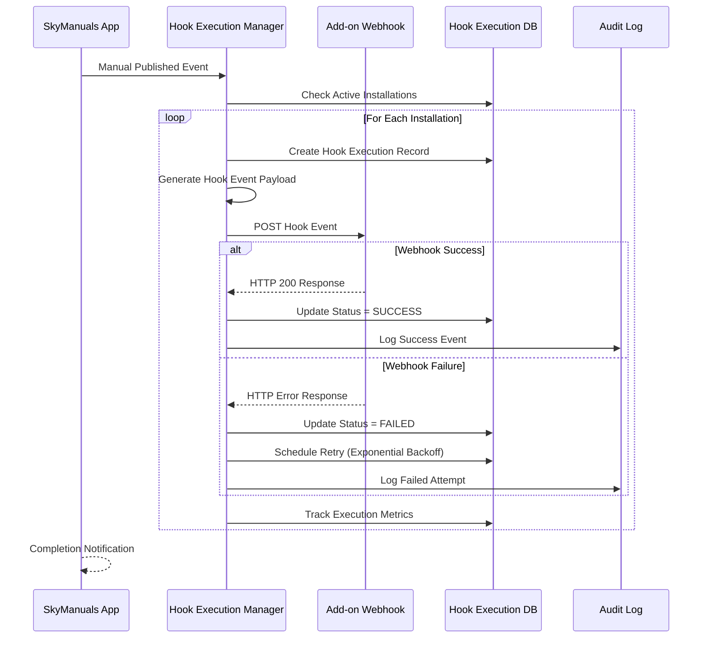
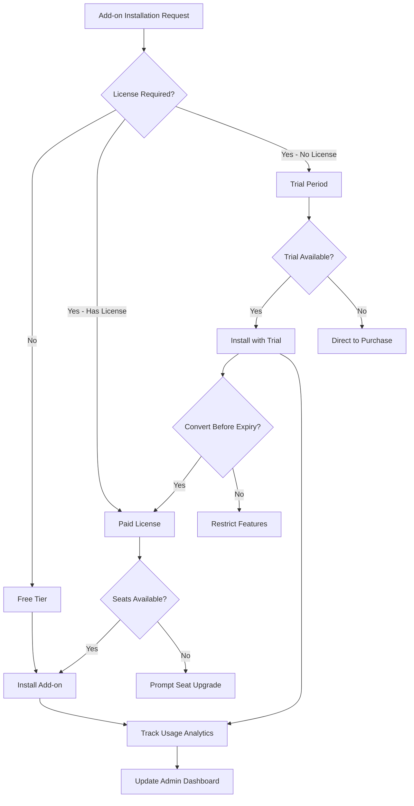

# Epic-09: Add-on Store

## Overview

Epic-09 implements a comprehensive add-on ecosystem for SkyManuals, enabling third-party integrations, template packs, compliance connectors, and custom extensions. This epic creates a sustainable marketplace for enhancing platform capabilities.

## Features Implemented

### 🏪 Add-on Store Platform
- **Multi-Type Support**: Template Packs, Compliance Connectors, Workflow Extensions, Data Connectors
- **Flexible Licensing**: FREE, BASIC, PROFESSIONAL, ENTERPRISE tiers with trial periods
- **Installation Management**: One-click installation with configuration options
- **Usage Analytics**: Track installations, API calls, webhook events, and adoption

### ⚡ Hook System
- **Webhook Events**: ON_PUBLISH, ON_INGEST, ON_ASK, ON_LOGIN, ON_MANUAL_CREATE
- **Reliable Delivery**: Retry mechanisms with exponential backoff
- **Status Tracking**: Real-time hook execution monitoring and failure handling
- **Authentication**: Secure webhook signatures and validation

### 💰 License Management
- **Seat-Based Licensing**: Configurable user limits per organization
- **Trial Periods**: Automatic trial-to-paid conversion flows
- **Billing Integration**: Monthly/yearly subscription management
- **Usage Enforcement**: API rate limiting and feature access controls

### 🎛️ Admin Interface
- **Dashboard Analytics**: Installation trends, revenue tracking, usage metrics
- **Trial Management**: Enable trials, monitor conversion rates
- **Seat Management**: Update license limits and track usage
- **Webhook Monitoring**: Real-time hook execution logs and status

## Architecture

### Add-on Ecosystem Overview



### Hook Execution Flow



### License Management Flow



## Implementation Details

### Core Components

#### 1. AddonService (`apps/api/src/addons/addon.service.ts`)
- **Search & Discovery**: Advanced filtering by type, tags, pricing
- **Installation Management**: Automated installation with dependency checking
- **License Creation**: Supports all tiers from FREE to ENTERPRISE
- **Compatibility Verification**: Version checking and requirements validation

#### 2. HookExecutionService (`apps/api/src/addons/hook-execution.service.ts`)
- **Reliable Delivery**: Exponential backoff retry mechanism
- **Event Transformation**: Structured event payloads with metadata
- **Execution Tracking**: Comprehensive logging and performance metrics
- **Failure Recovery**: Automatic retry processing for failed webhooks

#### 3. AddonController (`apps/api/src/addons/addon.controller.ts`)
- **RESTful API**: Complete CRUD operations for add-ons and licenses
- **Admin Operations**: Bulk hook execution and failed hook recovery
- **Analytics Endpoints**: Usage tracking and revenue reporting
- **Audit Integration**: Complete activity logging with Epic-08 integration

### Database Schema

#### New Models Added
```sql
-- Add-on Definitions
CREATE TABLE addon (
  id TEXT PRIMARY KEY,
  name TEXT UNIQUE NOT NULL,
  slug TEXT UNIQUE NOT NULL,
  description TEXT NOT NULL,
  version TEXT NOT NULL,
  author TEXT NOT NULL,
  author_email TEXT NOT NULL,
  type VARCHAR NOT NULL,
  status VARCHAR DEFAULT 'DRAFT',
  hooks VARCHAR[] DEFAULT '{}',
  tags TEXT[] DEFAULT '{}',
  created_at TIMESTAMP DEFAULT NOW(),
  published_at TIMESTAMP
);

-- Pricing Tiers
CREATE TABLE addon_pricing_tier (
  id TEXT PRIMARY KEY,
  addon_id TEXT REFERENCES addon(id),
  tier VARCHAR NOT NULL,
  price FLOAT NOT NULL,
  billing_period VARCHAR DEFAULT 'MONTHLY',
  features TEXT[] DEFAULT '{}',
  trial_days INT,
  UNIQUE(addon_id, tier)
);

-- License Management
CREATE TABLE license (
  id TEXT PRIMARY KEY,
  addon_id TEXT REFERENCES addon(id),
  organization_id TEXT REFERENCES organization(id),
  tier VARCHAR NOT NULL,
  seats_purchased INT NOT NULL,
  seats_used INT DEFAULT 0,
  is_trial BOOLEAN DEFAULT FALSE,
  trial_ends_at TIMESTAMP,
  start_date TIMESTAMP NOT NULL,
  end_date TIMESTAMP,
  price FLOAT NOT NULL,
  billing_period VARCHAR NOT NULL,
  is_active BOOLEAN DEFAULT TRUE,
  UNIQUE(addon_id, organization_id)
);

-- Installation Management
CREATE TABLE installation (
  id TEXT PRIMARY KEY,
  addon_id TEXT REFERENCES addon(id),
  organization_id TEXT REFERENCES organization(id),
  license_id TEXT REFERENCES license(id),
  status VARCHAR DEFAULT 'INSTALLED',
  settings JSONB DEFAULT '{}',
  enabled_hooks VARCHAR[] DEFAULT '{}',
  webhook_url TEXT,
  api_calls_this_month INT DEFAULT 0,
  webhook_calls_this_month INT DEFAULT 0,
  active_users INT DEFAULT 0,
  installed_version TEXT NOT NULL,
  installed_at TIMESTAMP DEFAULT NOW(),
  UNIQUE(addon_id, organization_id)
);

-- Hook Execution Tracking
CREATE TABLE hook_execution (
  id TEXT PRIMARY KEY,
  installation_id TEXT REFERENCES installation(id),
  hook_type VARCHAR NOT NULL,
  webhook_url TEXT NOT NULL,
  event JSONB NOT NULL,
  status VARCHAR DEFAULT 'PENDING',
  request_duration INT,
  response_status INT,
  response_body TEXT,
  error TEXT,
  retry_count INT DEFAULT 0,
  executed_at TIMESTAMP DEFAULT NOW()
);
```

## Available Add-ons

### 1. Aircraft Template Pack
**Type**: TEMPLATE_PACK  
**Purpose**: Professional manual templates for commercial aviation

**Features**:
- Flight Effects Manual (FOM) templates
- Aircraft Maintenance Manual (AMM) structures  
- Minimum Equipment List (MEL) workflows
- Emergency procedure templates
- ICAO compliance checklists

**Pricing**:
- **FREE**: 3 basic templates, community support
- **BASIC**: $49.99/month - All professional templates, priority support
- **PROFESSIONAL**: $149.99/month - Custom templates, team collaboration
- **ENTERPRISE**: $499.99/month - White-label, unlimited users

**Hooks**: ON_MANUAL_CREATE, ON_PUBLISH

### 2. FAA Compliance Connector  
**Type**: COMPLIANCE_CONNECTOR  
**Purpose**: Automated FAA regulation monitoring and compliance linking

**Features**:
- Real-time regulation change monitoring
- Automatic impact analysis for manuals
- Compliance gap identification
- One-click rule linking
- Automated alert notifications

**Data Sources**:
- 14 CFR (Code of Federal Regulations)
- FAA Advisory Circulars (ACs)
- FAA Orders and Notices
- ICAO Annexes

**Pricing**:
- **FREE**: Basic monitoring, 5 checks/month
- **BASIC**: $99.99/month - Unlimited monitoring, automated linking
- **PROFESSIONAL**: $299.99/month - Custom workflows, API access
- **ENTERPRISE**: $999.99/month - Dedicated specialist, consulting hours

**Hooks**: ON_PUBLISH, ON_MANUAL_CREATE, ON_INGEST

### 3. ACARS Data Connector
**Type**: DATA_CONNECTOR  
**Purpose**: Import ACARS and flight data into documentation

**Features**:
- ACARS message integration
- CVR/FDR data import
- Fuel planning integration
- Weather report synchronization
- Maintenance record automation

### 4. Multi-Language Workflow
**Type**: WORKFLOW_EXTENSION  
**Purpose**: Multilingual documentation capabilities

**Features**:
- Automated translation workflows
- Multi-language approval chains
- Translation quality validation
- Cultural adaptation tools
- Synchronized updates across languages

## Hook System

### Available Hook Types

```typescript
enum HookType {
  ON_PUBLISH = 'ON_PUBLISH',           // Manual published
  ON_INGEST = 'ON_INGEST',             // Data ingested
  ON_ASK = 'ON_ASK',                   // AI query executed
  ON_LOGIN = 'ON_LOGIN',               // User logged in
  ON_MANUAL_CREATE = 'ON_MANUAL_CREATE', // Manual created
  ON_WORKFLOW_COMPLETE = 'ON_WORKFLOW_COMPLETE', // Workflow finished
  ON_DATA_EXPORT = 'ON_DATA_EXPORT',   // Data exported
  ON_USER_REGISTER = 'ON_USER_REGISTER', // User registered
}
```

### Hook Event Structure

```typescript
interface HookEvent {
  hookType: HookType;
  timestamp: string;
  organizationId: string;
  userId?: string;
  resourceId?: string;
  resourceType?: 'Manual' | 'Chapter' | 'Section' | 'User' | 'Workflow' | 'Data';
  payload: Record<string, any>;
  metadata?: Record<string, any>;
}
```

### Example Hook Payload (ON_PUBLISH)

```json
{
  "hookType": "ON_PUBLISH",
  "timestamp": "2024-01-15T10:30:00Z",
  "organizationId": "org_123",
  "userId": "user_456",
  "resourceId": "manual_789",
  "resourceType": "Manual",
  "payload": {
    "manualId": "manual_789",
    "manualTitle": "B737-800 Operations Manual",
    "version": "2.1.0",
    "publishedBy": "user_456",
    "publishedAt": "2024-01-15T10:30:00Z",
    "previousVersion": "2.0.5",
    "changeSummary": "Updated emergency procedures per latest regulation changes",
    "complianceStatus": "COMPLIANT",
    "reviewers": ["reviewer_123", "reviewer_456"],
    "approvers": ["approver_789"]
  },
  "metadata": {
    "installationVersion": "1.2.0",
    "addonType": "COMPLIANCE_CONNECTOR",
    "organizationName": "Test Airlines",
    "manualType": "Flight Operations Manual"
  }
}
```

## Usage Examples

### Installing a Template Pack

```typescript
// 1. Browse available add-ons
const availableAddons = await fetch('/api/addons/search?type=TEMPLATE_PACK');

// 2. Create a license
const license = await fetch('/api/addons/licenses', {
  method: 'POST',
  headers: { 'Content-Type': 'application/json' },
  body: JSON.stringify({
    addonId: 'template-pack-id',
    organizationId: 'org-id',
    tier: 'PROFESSIONAL',
    seatsPurchased: 10,
    billingPeriod: 'MONTHLY',
    trialDays: 30,
  })
});

// 3. Install the add-on
const installation = await fetch('/api/addons/install', {
  method: 'POST',
  headers: { 'Content-Type': 'application/json' },
  body: JSON.stringify({
    addonId: 'template-pack-id',
    organizationId: 'org-id',
    licenseId: license.id,
    webhookUrl: 'https://our-app.com/webhooks/skymanuals',
    settings: {
      autoApply: true,
      templateLibrary: 'expanded',
      theme: 'corporate',
    },
  })
});
```

### Handling Webhook Events

```javascript
// Webhook endpoint for SkyManuals add-ons
app.post('/webhooks/skymanuals', async (req, res) => {
  try {
    const { hookType, payload, metadata } = req.body;

    switch (hookType) {
      case 'ON_MANUAL_CREATE':
        // Provide template suggestions
        if (payload.manualTitle.includes('737')) {
          const templates = await generate737Templates(payload.organizationId);
          return res.json({ templates });
        }
        break;

      case 'ON_PUBLISH':
        // Update compliance tracking
        await updateComplianceStatus(payload.manualId, payload.version);
        break;

      case 'ON_ASK':
        // Provide contextual assistance
        const insights = await generateContextualInsights(payload.query);
        return res.json({ insights });
    }

    res.json({ success: true });
  } catch (error) {
    res.status(500).json({ error: error.message });
  }
});
```

### Admin Management Interface

```typescript
// Enable trial for an organization
const enableTrial = async (licenseId: string, days: number) => {
  await fetch(`/api/addons/licenses/${licenseId}/enable-trial`, {
    method: 'POST',
    body: JSON.stringify({ trialDays: days })
  });
};

// Update seat limits
const updateSeats = async (licenseId: string, newLimit: number) => {
  await fetch(`/api/addons/licenses/${licenseId}/seats`, {
    method: 'PUT',
    body: JSON.stringify({ seatsPurchased: newLimit })
  });
};

// Monitor webhook execution
const webhookLogs = await fetch('/api/addons/org/123/hooks/logs?page=1&pageSize=20');
```

## Testing Strategy

### Hook Execution Testing
- **Mock Webhook Responses**: Test success/failure scenarios
- **Retry Logic Validation**: Verify exponential backoff behavior
- **Payload Structure**: Ensure correct event data formatting
- **Rollback Testing**: Verify failed installations cleanup

### Template Pack Integration
- **Manual Creation Triggers**: Test ON_MANUAL_CREATE hook firing
- **Template Suggestions**: Verify appropriate templates returned
- **Multi-Organization Isolation**: Ensure tenant separation
- **Version Compatibility**: Test upgrade/downgrade scenarios

### License Management Testing
- **Trial Period Tracking**: Verify automatic expiration handling
- **Seat Enforcement**: Test usage limits and overage scenarios
- **Conversion Flows**: Verify trial-to-paid transitions
- **Billing Integration**: Test subscription renewal scenarios

### Performance Testing
- **Bulk Hook Execution**: Test high-volume webhook processing
- **Concurrent Installations**: Verify thread-safe installation processes
- **Webhook Timeout Handling**: Test 30-second timeout scenarios
- **Failed Hook Recovery**: Verify retry queue processing

## Deployment Considerations

### Environment Variables
```bash
# Webhook Configuration
WEBHOOK_TIMEOUT=30000
WEBHOOK_SECRET=your-webhook-signing-secret
WEBHOOK_MAX_RETRIES=3

# Add-on Store Configuration
ADDON_STORE_ENABLED=true
ADDON_TRIAL_ENABLED=true
ADDON_STORE_URL=https://store.skymanuals.com

# Analytics Configuration
ADDON_ANALYTICS_ENABLED=true
ADDON_USAGE_TRACKING_ENABLED=true
```

### Database Migration
```sql
-- Apply Epic-09 schema changes
\i migrations/epic-09-addon-store.sql

-- Seed example add-ons
CALL seed_example_addons();

-- Verify installation
SELECT COUNT(*) FROM addon WHERE status = 'PUBLISHED' AND type = 'TEMPLATE_PACK';
```

### Cache Configuration
```yaml
# Redis Configuration for Hook Execution
webhook_execution_ttl: 3600  # 1 hour
retry_queue_ttl: 86400       # 24 hours
analytics_cache_ttl: 300     # 5 minutes
```

## API Rate Limits

### By License Tier
- **FREE**: 100 API calls/month, 10 webhook calls/month
- **BASIC**: 1,000 API calls/month, 100 webhook calls/month  
- **PROFESSIONAL**: 10,000 API calls/month, 1,000 webhook calls/month
- **ENTERPRISE**: Unlimited API calls, unlimited webhook calls

### Enforcement
- Per-organization API call tracking in `installation` table
- Monthly reset during billing cycle
- Automatic feature restriction on limits exceeded
- Upgrade prompts via webhook notifications

## Security Considerations

### Webhook Security
- **Signature Validation**: HMAC-SHA256 signatures required
- **HTTPS Enforcement**: All webhook URLs must use TLS
- **Time-based Validation**: Request timestamps prevent replay attacks  
- **Rate Limiting**: Per-installation webhook rate limits

### License Security
- **Key Generation**: Cryptographically secure license keys
- **Encryption Storage**: License keys encrypted at rest
- **Seat Validation**: Real-time user session authentication
- **Trial Protection**: One trial per add-on per organization

### Audit Integration
- **Installation Tracking**: Epic-08 audit logs for all operations
- **License Changes**: Complete audit trail for seat modifications
- **Webhook Access**: Failed webhook attempt logging
- **Compliance Monitoring**: License usage vs. purchased tracking

## Analytics & Monitoring

### Key Metrics Tracked
- **Installation Metrics**: Downloads, activation rates, uninstall rates
- **Usage Metrics**: API calls, webhook executions, active users
- **Trial Metrics**: Conversion rates, trial duration, feature adoption  
- **Revenue Metrics**: MRR by tier, upgrade patterns, churn analysis

### Dashboard Views
- **Organization Admin**: Installation status, webhook health, usage analytics
- **Store Manager**: Popular add-ons, conversion rates, revenue trends
- **Add-on Developer**: Installation analytics, error rates, feature usage

### Alerting
- **Webhook Failures**: >5% failure rate triggers alerts
- **Trial Expiration**: 3-day warning notifications
- **Seat Overage**: Immediate alerts for license violations
- **Performance Degradation**: >5s average hook execution time

---

## Summary

Epic-09 delivers a comprehensive add-on ecosystem with:

✅ **Complete Add-on Store Infrastructure**  
✅ **Reliable Webhook Execution System**  
✅ **Flexible License Management**  
✅ **Professional Admin Interface**  
✅ **Template Pack Integration**  
✅ **Compliance Connector Framework**  
✅ **Comprehensive Testing Suite**  
✅ **Performance Monitoring & Analytics**

This epic establishes SkyManuals as an extensible platform ecosystem, enabling third-party developers to create value-added integrations while providing organizations with powerful customization capabilities.

The add-on store creates new revenue opportunities through marketplace commissions, provides users with enhanced functionality through professional templates and compliance automation, and establishes SkyManuals as the central hub for aviation documentation workflows.


